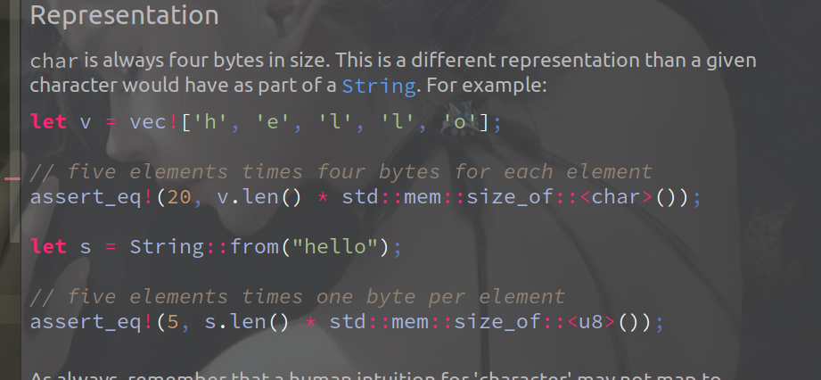

<!-- vim-markdown-toc GFM -->

- [计算机编码](#计算机编码)
  - [ASCII 编码:](#ascii-编码)
  - [Unicode 编码:](#unicode-编码)
  - [UTF-8 编码:](#utf-8-编码)
  - [各语言编码特点：](#各语言编码特点)
  - [移位操作：](#移位操作)

<!-- vim-markdown-toc -->

---

### 计算机编码

> 计算机只能处理数字，要处理文本，必须先把文本转换为二进制数字才能处理。如何转换，就是一套编码规则。
> 它约定了用什么样的信息来表示现实对象。  
> 1 byte = 8 bit，一个字节能表示2^8=256个不同字符，能表示最大整数255（除去0）。  
  要表示中文，显然一个字节，8位是不够多的。至少需要两个字节。  

**注**：  
- 要想保留二进制数的直观性，同时还要求写起来简短，十六进制数是最好的选择。通常书上都用一个框表示一个
  字节，即8个二进制位，两个16进制数字。  

- A：| 二进制 0100 0001 | 十进制 65 | 十六进制 0x41 (四个二进制位表示一个十六进制数)  

#### ASCII 编码:  
  - 最早的字符编码是ASCII码(America Standard Code For Information Interchange)。  

  - **特点**：  一个字符占用一个字节(byte)，8位，最高位总是0。  
    由于一个bit可以有0,1两个数，所以用ASCII码编码的一个字符类型最多可表示1 X 2^7 = 128 个
    不同字符。  

#### Unicode 编码:  
  - **产生背景**： 为了解决各个国家编码不一致的情况。  

  - **特点**： 一个字符占用2-4个字节(byte)，16-32位，最高位总是0。一个字符最多可表示  
    1 X 2^15 = 32768 个不同字符。  

  - **作用**： 能使计算机实现跨语言，跨平台的文本处理。  

#### UTF-8 编码:  
- **产生背景**：  
  - 英文的Unicode编码与ASCII不一致。

  - 由于Unicode的编码特性，包含大量英文的文本会浪费存储空间。  

- **特点**：  
  - 变长编码，英文UTF-8与ASCII一致，其他需2~6个字节不等。

  - 容错能力强，兼容性好。

- **编码方式**：
> 第一个字节开头为1的个数用来表示该字符有多少个字节。
  - 一个字节的首位永远是0，   0xxxxxxx。

  - 两个字节的首位永远是110， 110xxxxx 10xxxxxx

  - 三个字节的首位永远是1110，1110xxxx 10xxxxxx 10xxxxxx

  - 依此类推。。

- **作用**：  
  - 能使计算机实现跨语言，跨平台的文本处理，并比Unicode更节省空间，经常用来
    做传输编码。  

#### 各语言编码特点：
- C：     默认ASCII编码，所以一个char类型在32位系统上占8bit，1个byte。  
- C++：   兼容C，正常情况一个char类型占8位，也有宽wchar_t 和支持Unicode的char16和char32。  
- Python：诞生比Unicode标准发布还早，所以最早的python只支持ASCII编码。  
- Java：  Java平台无关，默认Unicode编码，一个char类型永远占16bit，2个byte，String类型也是Unicode编码。  
- Rust：  Rust平台无关，默认UTF-8编码，但一个char类型总是占32bit，4个byte。  
          要注意的是Rust里单个字符在String中占用的byte和单个字符存在占用的byte是不一样的。
          如下图：

#### 移位操作：
- 移位能实现整数除以或乘以2的n次方的效果。
  比如 y << n，与y 的 n 次方相等。
