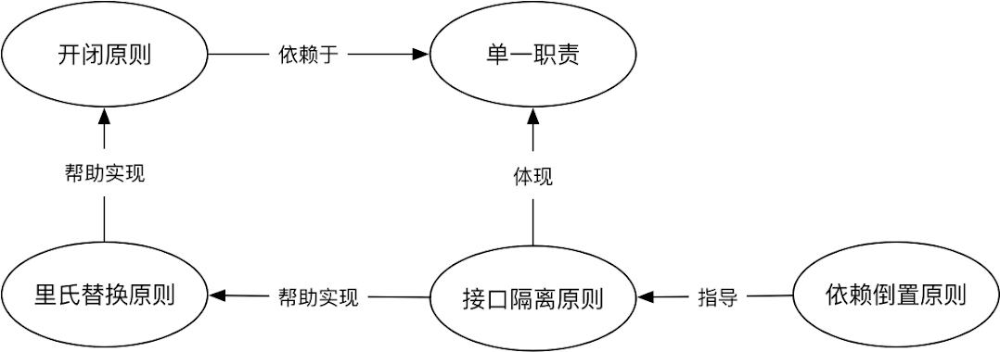

<!-- vim-markdown-toc GFM -->

- [设计模式](#设计模式)
  - [设计模式是什么？](#设计模式是什么)
  - [为什么要用设计模式？](#为什么要用设计模式)
  - [何时，何处使用设计模式?](#何时何处使用设计模式)
  - [怎么用，用到什么程度?](#怎么用用到什么程度)
  - [总体来说设计模式分为三大类：](#总体来说设计模式分为三大类)
  - [原则](#原则)
  - [软件架构](#软件架构)
  - [函数式编程](#函数式编程)

<!-- vim-markdown-toc -->

### 设计模式

> 职业惯例 -- 6W3H问一遍先

---

#### 设计模式是什么？  
设计模式是**面向对象编程思想**中一套被反复使用、多数人知晓的、经过分类编写的、
设计代码组织结构的经验总结。  

#### 为什么要用设计模式？  
- 使用设计模式不是为了解藕，而是为了代码重用，让代码好改。宏观角度上让功能模块
  更清晰地分割，更容易地扩展，保证代码可靠性，同时能使代码更易被他人理解。  

- 项目中**合理的**运用设计模式可以完美的解决很多问题，每一个模式描述了一个不断
  重复发生的问题，以及该问题的核心解决方案，这也是它能被广泛应用的原因。  

- 设计模式用在团队沟通上，统一代码风格。基本要求整个团队都要理解该模式，这样大
  家一看代码风格就猜到真正的逻辑代码在哪个文件哪个类哪个函数里。

#### 何时，何处使用设计模式?  
- 做设计模式的时候应该想好/沟通好**哪些需求可能变更**。  

- 引入设计模式**最恰当的时机**是需求变更的时候对代码的重构，而且要注意一次重构只引
  入最少量的设计模式，能满足本次变更的需求即可。

#### 怎么用，用到什么程度?  
- 使用设计模式会使代码逻辑更复杂，但可使代码在一定程度上解耦。但不要**过度设计**，
  某段代码不需要面向对象时，设计模式反而会让问题更复杂。  

- 设计模式是从已经完成的代码和设计中提炼的，不是在设计和编码之前构思的。

- 代码的复杂程度应该和业务逻辑的复杂程度有一个正比的关系。只有需求复杂度上去了，
  代码才应该越来越复杂。永远不要为了眼前不存在的需求引入设计模式，更不要为了美化
  代码而引入设计模式，为了抽象而抽象，为了解耦而解耦是没有意义的。这些都是过度设
  计最直接的根源。  

---

#### 总体来说设计模式分为三大类：  
> 设计模式的应用场景应结合业务和模式特点及设计原则进行分析，选用。

1. 创建型模式：单例模式、简单工厂(单车间)模式、抽象工厂(组装厂)模式、Builder(精细化生产线)模式、原型模式。  

2. 结构型模式：适配器模式、装饰器模式、代理模式、外观模式、桥接模式、组合模式、享元模式。  

3. 行为型模式：策略模式、观察者模式、模板方法模式、迭代器模式、责任链模式。  

4. 命令模式、中介者模式、状态模式、备忘录模式、访问者模式、解释器模式。  

5. 并发型模式和线程池模式。

#### 原则
1. 对功能扩展开放，对修改原代码封闭。

2. 组合优先继承：优先考虑组合，后考虑在行为一致的基础上使用继承。

3. 控制反转，依赖注入，面向接口：编程高层策略性代码不要依赖实现底层细节，底层细节的代码应该依赖高层策略性代码。

4. 创建(业务逻辑实现)与使用(对外接口，前端可视化呈现)分离。

5. 单一职责：一个模块只负责一类事情，有且只有一个被修改的理由。

6. 最少知识。

   

#### 软件架构
1. 定义出整个系统的层次结构(单向依赖)。

2. 清晰定义出每一个模块的系统边界。哪些方法可以被外部模块调用，哪些包内可见，哪些属于
   内部方法(接口的正交性)。

3. 好的模块设计，一定可以写出好的单元测试用例。如果模块测试起来很麻烦，那一定说明设计
   有问题。

4. 当大量方法都可以用static修饰时，一定说明设计思想还停留在面向过程。多尝试一些有内部
   属性的有状态对象。并最小化该对象对外提供的方法。

#### 函数式编程
因为面向对象的限制，或者语言的不灵活性，所以需要利用很多的模式来弥补实现上的缺失，而
采用函数式编程思维一定程度上可以减少模式的使用。

