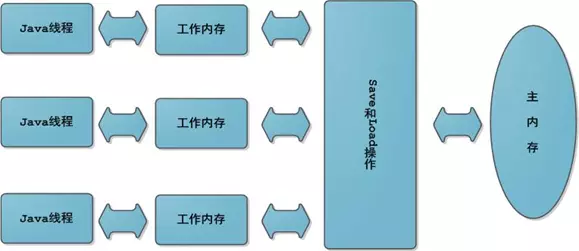
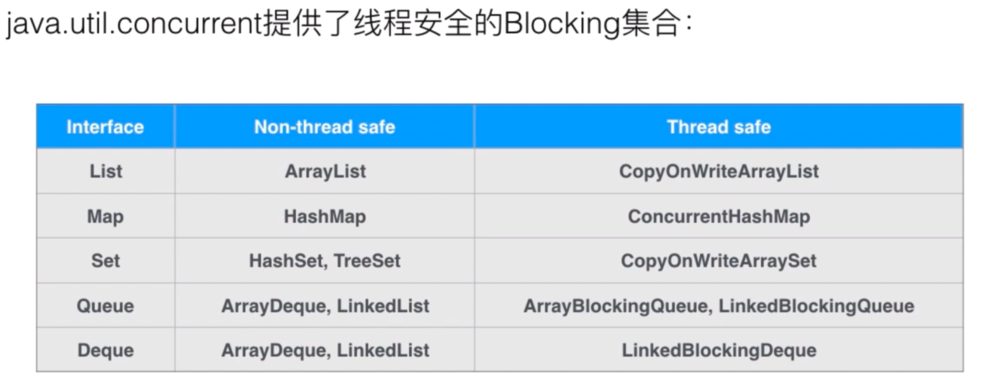

# JUC核心知识点

<!-- vim-markdown-toc GFM -->

- [1. JMM - Java Memory Model 和 几个关键字](#1-jmm---java-memory-model-和-几个关键字)
  - [1.1. volatile关键字](#11-volatile关键字)
  - [1.2. 哪些地方用到过volatile？](#12-哪些地方用到过volatile)
  - [1.3. synchronized 关键字](#13-synchronized-关键字)
  - [1.4. volatile 和 synchronized 关键字区别](#14-volatile-和-synchronized-关键字区别)
- [2. 线程](#2-线程)
  - [2.1. Java中线程的生命周期与状态：](#21-java中线程的生命周期与状态)
  - [2.2. 如何创建线程：](#22-如何创建线程)
  - [2.4. ThreadLocal](#24-threadlocal)
  - [2.3. 守护线程](#23-守护线程)
- [3. 传统并发编程的难点](#3-传统并发编程的难点)
  - [3.1. 如何处理线程之间的数据竞争问题：](#31-如何处理线程之间的数据竞争问题)
    - [3.1.1. Java锁](#311-java锁)
    - [3.1.2. 原子类型](#312-原子类型)
  - [3.2. 如何处理线程之间的竞态条件(线程之间如何通信协调－信息同步)](#32-如何处理线程之间的竞态条件线程之间如何通信协调信息同步)
    - [3.2.1. wait 和 notify](#321-wait-和-notify)
    - [3.2.2. 条件变量：ReentrantLock 和 Condition](#322-条件变量reentrantlock-和-condition)
    - [3.2.3. 屏障：CountDownLatch/CyclicBarrier](#323-屏障countdownlatchcyclicbarrier)
    - [3.2.4. 信号量：Semaphore](#324-信号量semaphore)
- [4. AQS-AbstractQueuedSynchronizer 抽象队列同步器](#4-aqs-abstractqueuedsynchronizer-抽象队列同步器)
- [5. 线程安全的集合类](#5-线程安全的集合类)
  - [5.1. 什么叫线程安全](#51-什么叫线程安全)
  - [5.2. Concurrent 集合类](#52-concurrent-集合类)
  - [5.3. List](#53-list)
  - [5.4. Set](#54-set)
  - [5.5. Map](#55-map)
- [6. 阻塞队列(同时解决数据竞争及竞态条件问题)](#6-阻塞队列同时解决数据竞争及竞态条件问题)
  - [6.1. 基本概念](#61-基本概念)
  - [6.2. 不同类型队列的区别](#62-不同类型队列的区别)
  - [6.3. 阻塞队列的应用——生产者消费者](#63-阻塞队列的应用生产者消费者)
- [7. 线程池——阻塞队列的应用](#7-线程池阻塞队列的应用)
  - [7.1. 为什么要用线程池(线程池的优点)](#71-为什么要用线程池线程池的优点)
  - [7.2. Executors 类的三种线程池创建方式](#72-executors-类的三种线程池创建方式)
  - [7.3. 实际生产使用 Executors 类中哪一个线程池？](#73-实际生产使用-executors-类中哪一个线程池)
  - [7.4. 线程池创建的七个参数](#74-线程池创建的七个参数)
  - [7.5. 线程池底层原理](#75-线程池底层原理)
  - [7.6. 线程池的拒绝策略](#76-线程池的拒绝策略)
  - [7.7. 自定义线程池参数选择](#77-自定义线程池参数选择)

<!-- vim-markdown-toc -->


# 1. JMM - Java Memory Model 和 几个关键字



- JMM是指Java**内存模型**。不是JVM **内存布局**，不是所谓的栈、堆、方法区。

- 每个Java线程都有自己的**工作内存**。操作数据，首先从主内存中读，得到一份拷贝，操作完毕后再回写到主内存。

- JMM可能带来**可见性**、**原子性**和**有序性**问题。  
  - 可见性是指某个线程对主内存内容的更改，应立刻通知到其它线程。  

  - 原子性是指一个操作是不可分割的，不能执行到一半，就不执行了。  

  - 有序性是指指令是有序的，不会被重排。

- 缓存一致性问题


## 1.1. volatile关键字
- **volatile** 关键字是Java提供的一种 **轻量级** 同步机制。主要用来修饰字段。  
  可以保证多个线程共享数据读取的 **可见性**和**有序性**。但不能保证**原子性**，如取反，写入。  
  - 被标记为volatile的字段会禁止编译器指令重排。

  - 每次访问字段时，总是从主内存获取最新值。

  - 每次修改变量后，立刻回写到主内存。

- 该关键字在C++中含义与Java中不一样，C++中没有线程同步的功能，即使有也只是部分编译器的扩展，无可移植性。  

- ### 可见性
  [可见性测试](./demo-src/thread/VolatileDemo.java)

  ```java
  class MyData{
      int number=0;
      //volatile int number=0;

      AtomicInteger atomicInteger=new AtomicInteger();
      public void setTo60(){
          this.number=60;
      }

      //此时number前面已经加了volatile，但是不保证原子性
      public void addPlusPlus(){
          number++;
      }

      public void addAtomic(){
          atomicInteger.getAndIncrement();
      }
  }

  //volatile可以保证可见性，及时通知其它线程主物理内存的值已被修改
  private static void volatileVisibilityDemo() {
      System.out.println("可见性测试");
      MyData myData=new MyData();//资源类
      //启动一个线程操作共享数据
      new Thread(()->{
          System.out.println(Thread.currentThread().getName()+"\t come in");
          try {TimeUnit.SECONDS.sleep(3);myData.setTo60();
          System.out.println(Thread.currentThread().getName()+"\t update number value: "+myData.number);}catch (InterruptedException e){e.printStackTrace();}
      },"AAA").start();
      while (myData.number==0){
       //main线程持有共享数据的拷贝，一直为0
      }
      System.out.println(Thread.currentThread().getName()+"\t mission is over. main get number value: "+myData.number);
  }
  ```

  `MyData`类是资源类，一开始number变量没有用volatile修饰，所以程序运行的结果是：

  ```java
  可见性测试
  AAA	 come in
  AAA	 update number value: 60
  ```

  虽然一个线程把number修改成了60，但是main线程持有的仍然是最开始的0，所以一直循环，程序不会结束。
  如果对number添加了volatile修饰，运行结果是：

  ```java
  AAA	 come in
  AAA	 update number value: 60
  main	 mission is over. main get number value: 60
  ```

  可见某个线程对number的修改，会立刻反映到主内存上。


- ### 原子性
  - volatile **不能保证操作的原子性**。比如一条number++的操作，会形成3条指令。

  ```assembly
  getfield        //读
  iconst_1	//++常量1
  iadd		//加操作
  putfield	//写操作
  ```

  - 假设有3个线程，分别执行number++，都先从主内存中拿到最开始的值，number=0，然后三个线程分别进行操作。  
    假设线程0执行完毕，number=1，立刻通知其它线程，但此时线程1、2已经拿到了number=0，所以结果就是写覆盖，线程1、2将number变成1。  

    解决的方式就是：
    1. 对`addPlusPlus()`方法加锁。
    2. 使用`java.util.concurrent.AtomicInteger`类。

  ```java
  private static void atomicDemo() {
      System.out.println("原子性测试");
      MyData myData=new MyData();
      for (int i = 1; i <= 20; i++) {
          new Thread(()->{
              for (int j = 0; j <1000 ; j++) {
                  myData.addPlusPlus();
                  myData.addAtomic();
              }
          }, String.valueOf(i)).start();
      }
      while (Thread.activeCount()>2){
          Thread.yield();
      }
      System.out.println(Thread.currentThread().getName()+"\t int type finally number value: "+myData.number);
      System.out.println(Thread.currentThread().getName()+"\t AtomicInteger type finally number value: "+myData.atomicInteger);
  }
  ```

  可见，由于`volatile`不能保证原子性，出现线程重复写的问题，最终结果比20000小。而`AtomicInteger`可以保证原子性。

  ```java
  原子性测试
  main	 int type finally number value: 17542
  main	 AtomicInteger type finally number value: 20000
  ```

- ### 有序性
  - volatile 可以保证**有序性**，即禁止CPU**指令重排**。  

  - 指令重排是指由于CPU的优化，指令执行的顺序跟程序员自己编写的顺序不一致。

  - 下面的例子，可能的执行顺序有1234、2134、1342，这三个最终结果都是x = 16，y=256。
    其中4依赖3的执行结果，3依赖1的赋值，那么3肯定在1之后，4肯定在3之后，即134顺序固定，不会被重排序。  
    而2和他们之间没有依赖关系，2可以放在任何地方。

    ```java
    int x = 11; //语句1
    int y = 12; //语句2
    x = x + 5;  //语句3
    y = x * x;  //语句4
    ```

  - volatile 底层是用CPU的**内存屏障**（Memory Barrier）指令来实现的，
    该指令一是保证特定操作的顺序性，二是保证变量的可见性。  
    在指令之间插入一条Memory Barrier指令告诉编译器和CPU，在Memory Barrier指令之间的指令不能被重排序。

  - [有序性案例](./demo-src/thread/ResortSeqDemo.java)


## 1.2. 哪些地方用到过volatile？

- #### 单例模式的安全问题
  **双重检验锁** 虽然加了同步，但是在多线程下依然会有线程安全问题。  

  ```java
  public class SingletonDemo {
      private static SingletonDemo singletonDemo=null;
      private SingletonDemo(){
          System.out.println(Thread.currentThread().getName()+"\t 我是构造方法");
      }
      //DCL模式 Double Check Lock 双端检索机制：在加锁前后都进行判断
      public static SingletonDemo getInstance(){
          if (singletonDemo==null){
              synchronized (SingletonDemo.class){
                   if (singletonDemo==null){
                       singletonDemo=new SingletonDemo();
                   }
              }
          }
          return singletonDemo;
      }

      public static void main(String[] args) {
          for (int i = 0; i < 10; i++) {
              new Thread(()->{
                  SingletonDemo.getInstance();
              }, String.valueOf(i+1)).start();
          }
      }
  }
  ```

  这个漏洞比较隐蔽，很难捕捉，但是是存在的。`instance = new SingletonDemo();` 可以大致分为三步

  ```java
  memory = allocate();     //1.分配内存
  instance(memory);	 //2.初始化对象
  instance = memory;	 //3.设置引用地址
  ```

  其中2、3没有数据依赖关系，**可能发生重排**。如果发生，此时内存已经分配，那么`instance = memory`不为null。
  如果此时线程挂起，`instance(memory)`还未执行，对象还未初始化。  
  由于`instance!=null`，所以两次判断都跳过， 最后返回的`instance`没有任何内容，还没初始化。  

- 解决的方法就是对`singletondemo`对象添加上`volatile`关键字，禁止指令重排。


## 1.3. synchronized 关键字
- ### 作用
  synchronized 解决多线程编程的数据竞争问题，它是一种互斥锁，被它修饰的方法或者代码块在任意时刻只能被一个线程执行。

- ### 怎么用(这应该是锁的知识点)

  - 锁代码块：括号指定加锁的对象，对给定的对象加锁，进入同步代码块前要获得对象的锁。

  - 锁实例方法：相当于给this加锁，对当前类实例加锁，进入同步代码块前要获得当前类对象实例的锁。

  - 锁静态方法、synchronized (class)，就是给当前类加锁，实际是锁类对应的Class实例。

- ### 注意
  - 尽量不要使用 synchronized (String a) 和 synchronized (Integer.valueOf(某数字))。

  - 前者因为JVM中字符串常量池具有缓存功能，相同的字符串都是同个对象。

  - 后者因为Integer.valueOf()方法为减少对象创建次数和节省内存，对[-128, 127]之间的数字会进行缓存，
    相同的int 会返回缓存中的包装对象。

- ### 底层实现
  - 修饰对象时

  - 修饰方法时


- ### JDK 1.6 之后底层的优化


- ### Synchronized和ReentrantLock的区别
- **共同点**      ：都是可重入锁

- **原始构成**    ：`sync`是JVM层面的，底层通过`monitorenter`和`monitorexit`来实现。`ReentrantLock`是JDK API层面的。
  （`sync`一个enter会有两个exit，一个是正常退出，一个是异常退出）

- **使用方法**    ：`sync`不需要手动释放锁，而`ReentrantLock`需要手动释放。

- **是否可中断**  ：`sync`不可中断，除非抛出异常或者正常运行完成。`ReentrantLock`是可中断的，通过调用`interrupt()`方法。

- **是否为公平锁**：`sync`只能是非公平锁，而`ReentrantLock`既能是公平锁，又能是非公平锁，构造时可传入参数。

- **绑定多个条件**：`sync`只能由JVM 随机唤醒阻塞的线程。  
  而`ReentrantLock`可绑定多个Condition，将线程注册在指定的Condition中，从而有选择得唤醒指定的线程，在线程调度上更灵活。


## 1.4. volatile 和 synchronized 关键字区别
- volatile 主要用来解决共享变量在多线程间的可见性，synchronized 解决数据的同步。

- volatile 能保证数据的可见性，但不能保证操作的原子性，synchronized 既能保证原子性，也能保证可见性。

- volatile 只能修饰字段，synchronized 可修饰方法和对象。

- volatile 不会阻塞线程，synchronized 会阻塞线程。

- volatile (CPU内存屏障指令) 性能好于 synchronized (Cpp Mutex Lock)。


# 2. 线程

## 2.1. Java中线程的生命周期与状态：
- 任一时刻，线程只能处于以下六种状态中的一种状态。

  

- **线程生命周期：**
  - 线程创建之后将处于 NEW（新建）状态。

  - 调用 start() 方法后开始运行，这时处于 READY（可运行）状态。

  - 可运行状态的线程获得了CPU 时间片（timeslice）后就处于 RUNNING（运行）状态。

  - 当线程执行 Object.wait() 或 Object.join() 方法之后，进入 WAITING（等待）状态。等待状态的线程需要依靠其他线程的通知才能返回到运行状态。

  - TIME_WAITING(超时等待) 状态相当于在等待状态的基础上增加了超时限制，如通过 sleep（long millis）方法或 wait（long millis）方法
    可以将 Java 线程置于 TIMED WAITING 状态。当超时时间到达后 Java 线程将会返回到 RUNNABLE 状态。

  - 当线程调用同步方法（被加锁的代码块）并且**没有获取到锁**时，线程将会进入 BLOCKED（阻塞）状态。

  - 线程执行完 Runnable 的run()方法之后将会进入到 TERMINATED（终止） 状态。


## 2.2. 如何创建线程：
- #### 1.2.1. 实现Runnable接口或 Callable接口(需用适配类FutureTask)

- **与Runnable的区别**：
  - Callable带返回值。

  - 会抛出异常。

  - 覆写`call()`方法，而不是`run()`方法。

- **Callable接口的使用**：
  ```java
  public class CallableDemo {
      //实现Callable接口
      class MyThread implements Callable<Integer> {
          @Override
          public Integer call() throws Exception {
              System.out.println("callable come in ...");
              return 1024;
          }
      }
      
      public static void main(String[] args) throws ExecutionException, InterruptedException {
          //创建FutureTask类，接受MyThread。    
          FutureTask<Integer> futureTask = new FutureTask<>(new MyThread());
          //将FutureTask对象放到Thread类的构造器里面。
          new Thread(futureTask, "AA").start();
          int result01 = 100;
          //用FutureTask的get方法得到返回值。
          int result02 = futureTask.get();
          System.out.println("result=" + (result01 + result02));
      }
  }
  ```

- #### 2.2.2. 继承Thread类

- #### 2.2.3. 利用工具类Executors...提供的方法
  注意：无界队列的大坑

- #### 2.2.4. 使用线程池底层API－ThreadPoolExecutor


## 2.4. ThreadLocal
- 是什么

- 原理

- 内存泄漏问题


## 2.3. 守护线程
- 守护线程是为其他线程服务的线程。  

- 所有的非守护线程都执行完毕后，虚拟机才会退出。

- 守护线程不能持有任何资源。


# 3. 传统并发编程的难点
- 现代CPU具有乱序执行、编译器具有对代码进行[指令重排](https://blog.csdn.net/lindanpeng/article/details/72459493)
  的优化特性。线程调度完全由系统内核控制，多个线程的执行顺序无法预测，同一段代码多次运行会产生不同的结果。  
  产生**竞态条件**问题。


- 多线程编程存在资源同步问题，即多个线程可以同时操作某个数据，同时读取同一块内存没有问题，同时写会出现**数
  据竞争**问题。


## 3.1. 如何处理线程之间的数据竞争问题：
> 根据不同的并发场景，不同的并发粒度、不同的优化角度，有不同类型的锁，如互斥锁，读写锁，自旋锁等。  

### 3.1.1. Java锁

- ### 互斥锁
  - 互斥锁就是**一个锁**只能被**一个线程**所持有，即同一时刻只允许单个线程对临界资源进行访问。  

  - `juc.ReentrantLock`和`synchronized`都是**互斥锁**。


- ### 可重入锁/递归锁
  - 可重入锁又叫递归锁，指的同一个线程在**外层方法**获得锁时，进入**内层方法**会自动获取锁。也就是说，
    线程可以进入任何一个它已经拥有锁的代码块。比如`get`方法里面有`set`方法，两个方法都有同一把锁，得到了`get`的锁，就自动得到了`set`的锁。

  - 可重入锁可以**避免死锁**的问题。

  - 详见[ReentrantLockDemo](./demo-src/thread/ReentrantLockDemo.java)。


- ### 读写锁/互斥-共享锁
  - 只允许一个线程写入，允许多个线程同时读取。**读锁**是**共享的**，**写锁**是**独占的**。  
    适合读多写少的场景。同一个实例，有大量线程读取，仅有少数线程修改。  
    例如一个论坛帖子，回复不频繁，可看作写入。浏览频繁，可看作读取。

  - 有时需要**读写分离**，那么就要引入读写锁，即`juc.ReentrantReadWriteLock`。
    比如缓存，就需要读写锁来控制。缓存就是一个键值对，以下Demo模拟了缓存的读写操作，读的`get`方法使用了`ReentrantReadWriteLock.ReadLock()`，
    写的`put`方法使用了`ReentrantReadWriteLock.WriteLock()`。这样避免写被打断，实现了多个线程同时读。  

  - [ReadWriteLockDemo](./demo-src/thread/ReadWriteLockDemo.java)


- ### 自旋锁
  - 自旋锁和互斥锁相似，但在获取锁失败时，线程不会**阻塞**，而是采用**不断轮询直到获取锁成功**。自己在那儿一直循环获取，就像“**自旋**”一样。
    好处是减少**线程切换的上下文开销**，缺点是会**消耗CPU**。  
    CAS底层的`getAndAddInt`就是**自旋锁**思想。

  ```java
  //跟CAS类似，一直循环比较。
  while (!atomicReference.compareAndSet(null, thread)) { }
  ```

  - 详见[SpinLockDemo](./demo-src/thread/SpinLockDemo.java)。


- ### 公平锁/非公平锁
  - **概念**：  
    - **公平锁**，就是多个线程按照**申请锁的顺序**来获取锁，类似排队，先到先得。

    - **非公平锁**，是多个线程抢夺锁，会导致**优先级反转**或**饥饿现象**。

  - **区别**：  
    - 公平锁在获取锁时先查看此锁维护的**等待队列**，**为空**或者当前线程是等待队列的**队首**，则直接占有锁，
      否则插入到等待队列，FIFO原则。

    - 非公平锁直接**尝试占有锁**，失败则采用公平锁方式。非公平锁的优点是**吞吐量**比公平锁更大。

  - `synchronized`和`juc.ReentrantLock`默认都是**非公平锁**。`ReentrantLock`在构造的时候传入`true`则是**公平锁**。


- ### 锁的配对
  锁之间要配对，加了几把锁，最后就得解开几把锁，下面的代码编译和运行都没有任何问题。但锁的数量不匹配会导致死循环。

  ```java
  lock.lock();
  lock.lock();
  try{
      someAction();
  }finally{
      lock.unlock();
  }
  ```

- ### 死锁
  - **什么是死锁**：多个线程各自持有不同的锁，并试图获取对方已持有的锁时，双方无限等待下去导致死锁。  
    |  线程1  |  线程2  |
    |---------|---------|
    | 持有A锁 | 持有B锁 |
    | 等待B锁 | 等待A锁 |

  - **形成条件**：  
    - 资源独占
    - 获得后永不放弃
    - 无法抢夺
    - 首位相连

  - **如何避免**： 多线程获取锁的顺序要一致。


- ### 死锁编码和定位
  主要是两个命令配合起来使用，定位死锁。

  - **jps**指令：`jps -l`可以查看运行的Java进程。

    ```java
    9688 thread.DeadLockDemo
    12177 sun.tools.jps.Jps
    ```

  - **jstack**指令：`jstack pid`可以查看某个Java进程的堆栈信息，同时分析出死锁。

    ```java
    =====================
    "Thread AAA":
      at xxxxx
      - waiting to lock <0x000111>
      - locked <0x000222>
      at java.lang.Thread.run
    "Thread BBB":
      at xxxxx
      - waiting to lock <0x000222>
      - locked <0x000111>
      at java.lang.Thread.run
    Found 1 deadlock.
  ```


### 3.1.2. 原子类型
- ### 概念
  - 修改临界数据结构的内部实现，确保对它们做任何更新，在外界看来都是原子性的，保证事务不可中断或者什
    么都不做，避免多线程中数据的不一致。

  - 原子类型是一种比锁更细粒度的数据结构内部控制手段。

  - 使用原子类型可实现无锁并发编程。


- ### 原子类有哪几种


- ### CAS-乐观锁
  CAS是指**Compare And Swap**，**比较并交换**，是一种乐观处理数据竞争的同步思想。  
  如果主内存的值跟期望值一样，那么就进行修改，否则一直重试，直到一致为止。

  ```java
  public class CASDemo {
      public static void main(String[] args) {
          AtomicInteger atomicInteger=new AtomicInteger(5);
          System.out.println(atomicInteger.compareAndSet(5, 2019)+"\t current data : "+ atomicInteger.get());
          //修改失败
          System.out.println(atomicInteger.compareAndSet(5, 1024)+"\t current data : "+ atomicInteger.get());
      }
  }
  ```

  第一次修改，期望值为5，主内存也为5，修改成功，为2019。第二次修改，期望值为5，主内存为2019，修改失败。

  查看`AtomicInteger.getAndIncrement()`方法，发现其没有加`synchronized`**也实现了同步**。这是为什么？


- ### CAS底层原理
  `AtomicInteger`内部维护了`volatile int value`和`private  static final Unsafe unsafe`两个比较重要的参数。

  ```java
  public final int getAndIncrement(){
      return unsafe.getAndAddInt(this, valueOffset,1);
  }
  ```

  `AtomicInteger.getAndIncrement()`调用了`Unsafe.getAndAddInt()`方法。  
  `Unsafe`类的大部分方法都是`native`的，用来像C语言一样从底层操作内存。

  ```java
  public final int getAnddAddInt(Object var1,long var2,int var4){
      int var5;
      do{
          var5 = this.getIntVolatile(var1, var2);
      } while(!this.compareAndSwapInt(var1, var2, var5, var5 + var4));
      return var5;
  }
  ```

  这个方法的var1和var2，就是根据**对象**和**偏移量**得到在**主内存的快照值** var5。然后`compareAndSwapInt`方法通过
  var1和var2得到当前**主内存的实际值**。如果这个**实际值**跟**快照值**相等，那么就更新主内存的值为var5+var4。  
  如果不等，那么就一直循环，一直获取快照，一直对比，直到实际值和快照值相等为止。

  比如有A、B两个线程，一开始都从主内存中拷贝了原值为3，A线程执行到`var5=this.getIntVolatile`，即var5=3。
  此时A线程挂起，B修改原值为4，B线程执行完毕，由于加了volatile，所以这个修改是立即可见的。  
  A线程被唤醒，执行`this.compareAndSwapInt()`方法，发现这个时候主内存的值不等于快照值3，所以继续循环，**重新**从主内存获取。


- ### CAS缺点
> CAS实际上是一种自旋锁。

1. 一直循环，开销比较大。
2. 只能保证一个变量的原子操作，多个变量依然要加锁。
3. 引出了**ABA问题**。


- ### ABA问题
  - ABA问题就是比较并交换的循环，存在一个**时间差**，而这个时间差可能带来意想不到的问题。

  - 比如线程T1将值从A改为B，然后又从B改为A。线程T2看到的就是A，但是**却不知道这个A发生了更改**。
    尽管线程T2 CAS操作成功，但不代表就没有问题。

  - 有的需求，比如CAS，**只注重头和尾**，只要首尾一致就接受。但是有的需求，还看重过程，中间不能发生任何修改，这就引出了`AtomicReference`原子引用。


- ### AtomicReference
  `AtomicInteger`对整数进行原子操作，如果是一个POJO呢？可以用`AtomicReference`来包装这个POJO，使其操作原子化。

  ```java
  User user1 = new User("Jack",25);
  User user2 = new User("Lucy",21);
  AtomicReference<User> atomicReference = new AtomicReference<>();
  atomicReference.set(user1);
  System.out.println(atomicReference.compareAndSet(user1,user2)); // true
  System.out.println(atomicReference.compareAndSet(user1,user2)); //false
  ```

- ### AtomicStampedReference和ABA问题的解决
  使用`AtomicStampedReference`类可以解决ABA问题。这个类维护了一个“**版本号**”Stamp，在进行CAS操作的时候，
  不仅要比较当前值，还要比较**版本号**。只有两者都相等，才执行更新操作。

  ```java
  AtomicStampedReference.compareAndSet(expectedReference,newReference,oldStamp,newStamp);
  ```

  详见[ABADemo](./demo-src/thread/ABADemo.java)。


## 3.2. 如何处理线程之间的竞态条件(线程之间如何通信协调－信息同步)
> 因为存在竞态条件，所以需要线程之间进行通信确保执行的先后顺序，本质是消息的同步，消除信息差。

### 3.2.1. wait 和 notify
这两个方法解决线程间协调(执行顺序)的问题。当条件不满足时，线程进入等待状态。

- wait方法**只能**在synchronized语句块中调用。

- 假设this指向一个用来封装线程间共享数据结构的类实例。调用wait方法后将**释放this的锁**，并使调
  用synchronized-wait语句块的线程进入**等待状态**。

- 当某个条件满足，其他线程调用this.notify方法**唤醒等待的线程**，等待的线程将**重新获得this的锁**。  

  


### 3.2.2. 条件变量：ReentrantLock 和 Condition
- 配合可以替代synchronized与wait-notify的功能，Condition对象必须从ReentrantLock对象获取。

- RenenterLock构造时可指定是公平锁还是非公平锁，以及超时时间。


### 3.2.3. 屏障：CountDownLatch/CyclicBarrier
- 让一组线程在一个同步点同步，如有线程未到就阻塞所有线程直至全部线程到达。

- ### CountDownLatch
  - `CountDownLatch`内部维护了一个**计数器**，只有当**计数器==0**时，某些线程才会停止阻塞，开始执行。
    `CountDownLatch`主要有两个方法，`countDown()`来让计数器-1，`await()`来让线程阻塞。当`count==0`时，阻塞线程自动唤醒。

  - **案例一班长关门**：main线程是班长，6个线程是学生。只有6个线程运行完毕，都离开教室后，main线程班长才会关教室门。

  - **案例二秦灭六国**：只有6国都被灭亡后（执行完毕），main线程才会显示“秦国一统天下”。

  - 枚举类的使用
    在**案例二**中会使用到枚举类，因为灭六国，循环6次，想根据`i`的值来确定输出什么国，比如1代表楚国，2代表赵国。
    如果用判断则十分繁杂，而枚举类可以简化操作。  
    枚举类就像一个**简化的数据库**，枚举类名就像数据库名，枚举的项目就像数据表，枚举的属性就像表的字段。  
    关于`CountDownLatch`和枚举类的使用，请看[CountDownLatchDemo](./demo-src/thread/CountDownLatchDemo.java)。


- ### CyclicBarrier
  - `CountDownLatch`是减，而`CyclicBarrier`是加。
    让一组线程在一个同步点同步，如有线程未到就阻塞所有线程直至全部线程到达。

  - 详见[CyclicBarrierDemo](./demo-src/thread/CyclicBarrierDemo.java)。


### 3.2.4. 信号量：Semaphore
`CountDownLatch`的问题是**不能复用**。比如`count=3`，那么加到3，就不能继续操作了。
而`Semaphore`可以解决这个问题，比如6辆车3个停车位，对于`CountDownLatch`**只能停3辆车**，
而`Semaphore`可以停6辆车，车位空出来后，其它车可以占有，这就涉及到了`Semaphore.accquire()`和`Semaphore.release()`方法。

```java
Semaphore semaphore=new Semaphore(3);
for (int i = 1; i <=6 ; i++) {
    new Thread(()->{
        try {
            //占有资源
            semaphore.acquire();
            System.out.println(Thread.currentThread().getName()+"\t抢到车位");
            try{ TimeUnit.SECONDS.sleep(3);} catch (Exception e){e.printStackTrace(); }
      System.out.println(Thread.currentThread().getName()+"\t停车3秒后离开车位");
      } 
      catch (InterruptedException e) {e.printStackTrace();} 
      //释放资源
      finally {semaphore.release();}
    },String.valueOf(i)).start();
}
```

# 4. AQS-AbstractQueuedSynchronizer 抽象队列同步器


# 5. 线程安全的集合类

## 5.1. 什么叫线程安全
如果一个方法、数据结构或库在多线程环境中不会出现任何问题，则可以称为**线程安全**。  


## 5.2. Concurrent 集合类
- 线程安全的集合类。

  

- 关于集合不安全类请看[ContainerNotSafeDemo](./demo-src/thread/ContainerNotSafeDemo.java)。


## 5.3. List
- ### ArrayList
  不是线程安全类，在多线程同时写的情况下，会抛出`java.util.ConcurrentModificationException`异常。

  ```java
  private static void listNotSafe() {
      List<String> list=new ArrayList<>();
      for (int i = 1; i <= 30; i++) {
          new Thread(() -> {
              list.add(UUID.randomUUID().toString().substring(0, 8));
              System.out.println(Thread.currentThread().getName() + "\t" + list);
          }, String.valueOf(i)).start();
      }
  }
  ```

- **解决方法**：
  - 使用`Vector`（`ArrayList`所有方法加`synchronized`，太重）。
  - 使用`Collections.synchronizedList()`转换成线程安全类。
  - 使用`java.concurrent.CopyOnWriteArrayList`（推荐）。


- ### CopyOnWriteArrayList
> 通过**写时复制**来实现**读写分离**。比如其`add()`方法，就是先**复制**一个新数组，长度为原数组长度+1，然后将新数组最后一个元素设为添加的元素。

  ```java
  public boolean add(E e) {
      final ReentrantLock lock = this.lock;
      lock.lock();
      try {
          //得到旧数组
          Object[] elements = getArray();
          int len = elements.length;
          //复制新数组
          Object[] newElements = Arrays.copyOf(elements, len + 1);
          //设置新元素
          newElements[len] = e;
          //设置新数组
          setArray(newElements);
          return true;
      } finally {
          lock.unlock();
      }
  }
  ```

## 5.4. Set
> 跟List类似，HashSet 和 TreeSet 都不是线程安全的，与之对应的有 CopyOnWriteSet 这个线程安全类。这个类底层维护了一个 CopyOnWriteArrayList 数组。
  ```java
  private final CopyOnWriteArrayList<E> al;
  public CopyOnWriteArraySet() {
      al = new CopyOnWriteArrayList<E>();
  }
  ```

- ### HashSet
  HashSet 底层用 HashMap 实现。既然是用 HashMap 实现的，那 HashMap.put() 需要传**两个参数**，
  而 HashSet.add() 只**传一个参数**，这是为什么。
  实际上 HashSet.add() 就是调用的 HashMap.put() ，只不过**Value**被写死了，是一个 private static final Object 对象。


## 5.5. Map
- ### HashMap 不是线程安全的

- ### Hashtable 是线程安全的，但是跟 Vector 类似，太重量级。

- ### ConcurrentHashMap 是线程安全的


# 6. 阻塞队列(同时解决数据竞争及竞态条件问题)

## 6.1. 基本概念
- **概念**：当阻塞队列为空时，获取（take）操作是阻塞的。当阻塞队列为满时，添加（put）操作是阻塞的。

  

- **好处**：阻塞队列不用手动控制什么时候该被阻塞，什么时候该被唤醒，简化了操作。

- **体系**：
  Collection --> Queue --> BlockingQueue  七个阻塞队列实现类。

  > 粗体标记的三个用得比较多，许多消息中间件底层就是用它们实现的。

  | 类名                    | 作用                             |
  | ----------------------- | -------------------------------- |
  | **ArrayBlockingQueue**  | 由**数组**构成的**有界**阻塞队列 |
  | **LinkedBlockingQueue** | 由**链表**构成的**有界**阻塞队列 |
  | PriorityBlockingQueue   | 支持优先级排序的无界阻塞队列     |
  | DelayQueue              | 支持优先级的延迟无界阻塞队列     |
  | **SynchronousQueue**    | 单个元素的阻塞队列               |
  | LinkedTransferQueue     | 由链表构成的无界阻塞队列         |
  | LinkedBlockingDeque     | 由链表构成的双向阻塞队列         |


## 6.2. 不同类型队列的区别
- 无界队列与有界队列的**区别**及**使用场景**

- 线程池设置了最大数线程数却达不到，同时**内存一直飙升**，为什么。

- **注意**：**LinkedBlockingQueue** 虽然有界，但其默认大小是`Integer.MAX_VALUE`，高达21亿，
  一般情况下内存早爆了（在线程池的**ThreadPoolExecutor**有体现）。

- **构造函数API**：
  - 抛出异常是指当队列满时，再次插入会抛出异常。

  - 返回布尔是指当队列满时，再次插入会返回false。

  - 阻塞是指当队列满时，再次插入会被阻塞，直到队列取出一个元素，才能插入。

  - 超时是指当一个时限过后，才会插入或者取出。

  - API使用见[BlockingQueueDemo](./demo-src/thread/BlockingQueueDemo.java)。

  | 方法类型 | 抛出异常  | 返回布尔   | 阻塞     | 超时                     |
  | -------- | --------- | ---------- | -------- | ------------------------ |
  | 插入     | add(E e)  | offer(E e) | put(E e) | offer(E e,Time,TimeUnit) |
  | 取出     | remove()  | poll()     | take()   | poll(Time,TimeUnit)      |
  | 队首     | element() | peek()     | 无       | 无                       |

- **SynchronousQueue**
  - 队列只有一个元素，如想插入多个，必须等队列元素取出后才能插入，只有一个“坑位”，用一个插一个。  

  - 详见[SynchronousQueueDemo](./demo-src/thread/SynchronousQueueDemo.java)。


## 6.3. 阻塞队列的应用——生产者消费者
- ### 传统模式
  传统模式使用`Lock`来进行操作，需要手动加锁、解锁。详见[ProdConsTradiDemo](./demo-src/thread/ProdConsTradiDemo.java)。

  ```java
  public void increment() throws InterruptedException {
      lock.lock();
      try {
          //1 判断 如果number=1，那么就等待，停止生产
          while (number != 0) {
              //等待，不能生产
              condition.await();
        }
    //2 干活 否则，进行生产
    number++;
          System.out.println(Thread.currentThread().getName() + "\t" + number);
    //3 通知唤醒 然后唤醒消费线程
    condition.signalAll();
      } catch (Exception e) {
          e.printStackTrace();
      } finally {
          //最后解锁
          lock.unlock();
      }
  }
  ```


- ### 阻塞队列模式
  使用阻塞队列就不需要手动加锁了，详见[ProdConsBlockQueueDemo](./demo-src/thread/ProdConsBlockQueueDemo.java)。

  ```java
  public void myProd() throws Exception {
      String data = null;
      boolean retValue;
      while (FLAG) {
          data = atomicInteger.incrementAndGet() + "";//++i
          retValue = blockingQueue.offer(data, 2L, TimeUnit.SECONDS);
          if (retValue) {
              System.out.println(Thread.currentThread().getName() + "\t" + "插入队列" + data + "成功");
          } else {
              ystem.out.println(Thread.currentThread().getName() + "\t" + "插入队列" + data + "失败");
          }
          TimeUnit.SECONDS.sleep(1);
      }
      System.out.println(Thread.currentThread().getName() + "\tFLAG==false，停止生产");
  }
  ```


# 7. 线程池——阻塞队列的应用

## 7.1. 为什么要用线程池(线程池的优点)
- 线程复用    ：不用new新线程，重复利用已经创建的线程来降低线程的创建和销毁开销，节省系统资源。

- 提高响应速度：当任务达到时，不用创建新的线程(创建线程有开销)，直接利用线程池的线程。

- 方便统一管理：可以控制最大并发数，控制线程的创建等。


## 7.2. Executors 类的三种线程池创建方式
- **newFixedThreadPool**：使用`LinkedBlockingQueue`实现，固定数量线程。
  ```java
  public static ExecutorService newFixedThreadPool(int nThreads) {
      return new ThreadPoolExecutor(nThreads, nThreads,
                                    0L, TimeUnit.MILLISECONDS,
                                    new LinkedBlockingQueue<Runnable>());
  }
  ```

- **newSingleThreadExecutor**：使用`LinkedBlockingQueue`实现，只有一个线程。
  ```java
  public static ExecutorService newSingleThreadExecutor() {
      return new FinalizableDelegatedExecutorService(new ThreadPoolExecutor(1, 1,
                                      0L, TimeUnit.MILLISECONDS,
                                      new LinkedBlockingQueue<Runnable>()));
  }
  ```

- **newCachedThreadPool**：使用`SynchronousQueue`实现，定长线程池。
  ```java
  public static ExecutorService newCachedThreadPool() {
      return new ThreadPoolExecutor(0, Integer.MAX_VALUE,
                                   60L, TimeUnit.SECONDS,
                                   new SynchronousQueue<Runnable>());
  }
  ```

- **newScheduledThreadPool**：使用`DelayedWorkQueue`实现，定长线程池。
  ```java
  public static ScheduledExecutorService newScheduledThreadPool(
          int corePoolSize, ThreadFactory threadFactory) {
      return new ScheduledThreadPoolExecutor(corePoolSize, threadFactory);
  }

  public ScheduledThreadPoolExecutor(int corePoolSize, ThreadFactory threadFactory) {
      super(corePoolSize, Integer.MAX_VALUE, 0, NANOSECONDS,
            new DelayedWorkQueue(), threadFactory);
  }
  ```

## 7.3. 实际生产使用 Executors 类中哪一个线程池？
- 上面的单一、可变、定长都不用！

- 从上面的源码可以看出：
  - **newFixedThreadPool 和 newSingleThreadExecutor** 都是 **LinkedBlockingQueue** 实现，队列长度
    为Integer.MAX_VALUE，相当于无界队列，可能堆积大量的任务导致OOM。

  - **newCachedThreadPool 和 newScheduledThreadPoolExecutor** 允许的最大线程数都是Integer.MAX_VALUE，
    可能创建大量的线程导致OOM。

- 实际生产一般自己通过 **ThreadPoolExecutor 的7个参数，自定义线程池**。

  ```java
  ExecutorService threadPool=new ThreadPoolExecutor(
                          2, 5, 1L, TimeUnit.SECONDS,
                          new LinkedBlockingQueue<>(3),
                          Executors.defaultThreadFactory(),
                          new ThreadPoolExecutor.AbortPolicy());
  ```


## 7.4. 线程池创建的七个参数

  | 参数            | 意义                       |
  | --------------- | -------------------------- |
  | corePoolSize    | 线程池常驻核心线程数       |
  | maximumPoolSize | 能够容纳的最大线程数       |
  | keepAliveTime   | 空闲线程存活时间           |
  | unit            | 存活时间单位               |
  | workQueue       | 存放提交但未执行任务的队列 |
  | threadFactory   | 创建线程的工厂类           |
  | handler         | 等待队列满后的拒绝策略     |

- 线程池的创建参数，就像一个**银行**。  

- `corePoolSize`就像银行的“**当值窗口**“，比如今天有**2位柜员**在受理**客户请求**（任务）。  

- 如果超过2个客户，那么新的客户就会在**等候区**（等待队列`workQueue`）等待。  

- 当**等候区**也满了，这个时候就要开启“**加班窗口**”，让其它3位柜员来加班，此时达到**最大窗口**`maximumPoolSize`，为5个。  

- 如果开启了所有窗口，等候区依然满员，此时就应该启动”**拒绝策略**“`handler`，告诉不断涌入的客户，叫他们不要进入，已经爆满了。  

- 由于不再涌入新客户，办完事的客户增多，窗口开始空闲，这个时候就通过`keepAlivetTime`将多余的3个”加班窗口“取消，恢复到2个”当值窗口“。


## 7.5. 线程池底层原理

- #### 原理图


- #### 流程图：


- 新任务到达。

- 如果正在运行的线程数小于`corePoolSize`，创建核心线程；大于等于`corePoolSize`，放入等待队列。

- 如果等待队列已满，但正在运行的线程数小于`maximumPoolSize`，创建非核心线程；大于等于`maximumPoolSize`，启动拒绝策略。

- 当一个线程无事可做一段时间`keepAliveTime`后，如果正在运行的线程数大于`corePoolSize`，则关闭非核心线程。


## 7.6. 线程池的拒绝策略
> 当等待队列满时，且达到最大线程数，再有新任务到来，就需要启动拒绝策略。JDK提供了四种拒绝策略。

1. **AbortPolicy**        ：默认的策略，直接抛出`RejectedExecutionException`异常，阻止系统正常运行。

2. **CallerRunsPolicy**   ：既不会抛出异常，也不会终止任务，而是将任务返回给调用者。

3. **DiscardOldestPolicy**：抛弃队列中等待最久的任务，然后把当前任务加入队列中尝试再次提交任务。

4. **DiscardPolicy**      ：直接丢弃任务，不做任何处理。


## 7.7. 自定义线程池参数选择
- 对于CPU密集型任务，最大线程数是CPU线程数+1。

- 对于IO密集型任务，尽量多配点，可以是CPU线程数\*2，或者CPU线程数/(1-阻塞系数)。

