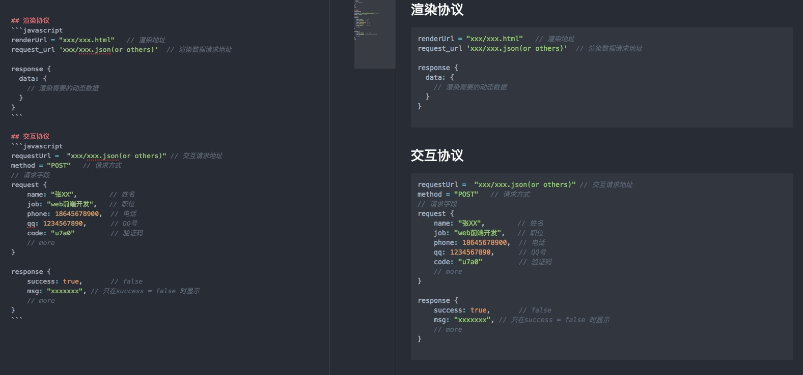

<!-- vim-markdown-toc GFM -->

- [开发流程](#开发流程)
  - [前后端正常交互流程](#前后端正常交互流程)
  - [后端开发流程](#后端开发流程)
- [文档化](#文档化)
- [代码分支、管理与提交](#代码分支管理与提交)
- [代码质量保证](#代码质量保证)
  - [开发习惯](#开发习惯)
- [代码注释及命名规范](#代码注释及命名规范)
- [代码复查(Code Review)](#代码复查code-review)
  - [日志与异常记录](#日志与异常记录)
  - [调试](#调试)
  - [单元测试](#单元测试)
  - [重构与维护](#重构与维护)
  - [技术氛围建设及团队沟通](#技术氛围建设及团队沟通)

<!-- vim-markdown-toc -->

> 拆分化简复杂模块，设计平滑过度的由简入繁的技术路线，抽象复用高层逻辑。
  复杂系统监控，debug，性能分析和优化。

### 开发流程

#### 前后端正常交互流程

1. 评审阶段：产品召集前后端进行需求评审，前后端各自捋清楚自己的业务量以及联调之间工作量，从而进行开发时间评估。

2. 开发准备阶段：前后端一起商量需求中需要联调的部分，进行接口的口头协议交流。

3. 接口定义阶段：前后端中的一方根据之前的口头协议拟定出一份详细的接口，并书写API文档，完成后由另一方确认。
   有疑问的地方重新商量直至双方都没有问题。注意：第一份确认并书写好API的接口基本不会大改。

4. 开发阶段：双方根据协商出来的接口为基础进行开发，如在开发过程中发现需要新增或删除一些字段，重复步骤3。
   注意：前端在开发过程中记得跟进接口，mock数据进行本地测试。

5. 联调阶段：双方独自的工作完成，开始前后端联调，如在联调过程发现有疑问，重复步骤3，直至联调完成。

6. 产品体验阶段：将完成的需求交给产品，让其体验，直至产品这边没有问题

7. 提测阶段：将完成的需求提给测试人员，让其对该需求进行测试，如发现问题，及时通知开发并让其修改，直至需求没有bug。

8. 评审单发布阶段：前后端中的一人进行评审单的拟定，发送给对应的领导，表明需求发布的程序，包括影响到的页面及业务，发布的流程，发布的回滚方案等。

9. 发布阶段：前后端双方在保证步骤1-8都没有问题了，进行各自的代码发布，完成后由测试人员在线上进行相应的测试，如果有bug，重复步骤7和9，直至需求成功上线。

正常接口文档的书写格式（字段名协商拟定）

#### 后端开发流程
- 团队项目开发前的统一三要素：统一需求/开发文档，统一编码规范，统一环境(编译/测试/发布)。

- 设计文档：包含需求背景，技术调研，技术选型，关键流程图，架构图，数据表设计，接口功能格式设计，项目排期等。可以据此构造一个模板，每次填写相关项。

- 设计方案： review。根据项目大小和重要性由同事共同 review 技术方案，最好组内有技术老手负责把关。使用 google doc 来编写技术方案文档。

- 编码实现： 使用公司规定的 git 工作流和编码规范开发，至少一个同事负责代码 review。

- 单测+自测：项目最好有单测，接口自测。一般来说会有自己的开发环境来自测。

- 测试工程师提测(提测模板：包含需求背景，测试流程，期望结果等)。

- 压力测试：如果预估有相当大的访问压力，可以上线之前使用压力测试工具压测，防止线上出问题，比如使用 locust 来压测并生成结果。

- bug 跟进和修复，复盘总结问题等。可以根据 bug 影响级别定级，高级别 bug 需要一起复盘总结，防止再次出问题。

### 文档化
- 将重复的东西文档化。常用的部署步骤，常用命令可以记录下来，可使用 gitbooks 或者readthedoc等文档工具记录。

- 可以帮助快速了解业务和需求变更历史的材料。如需求文档，数据库字段的含义，项目的功能变更历史。

- 只有少数很复杂的系统需要详细的文档，架构图、UML、数据模型、处理流程、业务逻辑等需要整理成文档。

### 代码分支、管理与提交
> 可以参考开源项目做法

- 做好代码分支管理，分清楚开发、特性、bugfix等代码分支

- 不要在同一个分支上一下**修改太多**功能，导致修复问题不好定位。一次只做一件事。  
  比如一个人把几个需求堆到一个分支改了，把不该上的功能也给上了，就会给测试、上线等带来严重麻烦。

- 命名分支的时候用有意义的命名，比如附带上task的号码等，把分支和要解决的问题关联起来。

- 规范化 Git 提交的信息，增加前缀说明或ID，比如是功能特性添加，bugfix，还是修改配置等。

### 代码质量保证
- 认知理念  
  代码除了完成需求外，最重要的就是维护和协作。对自己也对其他人负责，这是个显而易见但是没多少人严格遵守的东西。
  一开始的负责会为以后协作和维护带来极大便利。

- Code Quality: Simple, Well-tested, Bug free, Clear, Refactored, Documented, Extensible, Fast.

- 编码规范(注释、命名、代码格式化工具)、静态分析(复杂度测试)、代码覆盖率、代码审查和单元测试。

#### 开发习惯
- 确保正确理解需求，确保熟悉所做的业务，正确理解业务能减少很多无用功。  
  需求分析，适当设计。流程图或者文档有时候可以帮助理清楚业务。  
  做一个稍微大点的需求都需要写设计文档。可以通过复述给产品人员听的方式确认双方是否理解一致。

- 重视规范及制度。通过良好的工程管理制度、编码习惯、测试和 code review 来消除缺陷。

- 文档驱动编程，注释先行。意图导向，明确表达。保证代码功能、意图可追溯。  
  > 让人上来就看一段不知所云的代码无比痛苦。写代码有时候和写文章、论文差不多，可以在注释里附上相关链接。  

  - 在代码、提交信息、文档中记录需求文档地址、引用地址等。方便维护者能够根据代码提交寻找代码意图，尤其是几乎没有任何文档注释的代码。
    有时对于很复杂的业务逻辑可用自然语言描述步骤，之后再用代码实现。

  - 写一个模块、类或者函数之前先想好它的功能，按照功能命名，之后写简单的注释描述其意图和功能，通常不超过三句话，但能让后来的维护者快速了解意图。  

  - commit 信息须能体现代码提交意图(修复 bug、新 feature、代码优化等)。

- 边写边测，增量式编程。对于稍复杂的逻辑要写单测，以便及时发现错误，越早发现越容易修复。TDD 的好处之一就是改善设计，自顶向下考虑。  
  从测试的角度想着如何编码，即是从用户角度考虑。好的设计一定能写出好的单元测试

- 边开发，边重构，及时清理技术债。应及时重构不好的代码(圈复杂度太高、可读性差、代码重复等)，这时的重构成本是最小的，因为当时就能看懂。

- 善用工具。代码风格、质量、复杂度测试相关的检查工具。持续集成工具。

- 结对编程。结对编程和TDD是极限编程中大力提倡的，有时候两个人一起边讨论边写代码要比写完后在 gitlab 一条条评论快很多，结对能帮助新人快速上手。

- 番茄工作法，劳逸结合，一次只做一件事。长时间专注写代码是非常消耗精力的。确保编码期间足够专注。快速迭代。

### 代码注释及命名规范
- 注释先行，意图导向，明确表达，可追溯(附上需求文档地址，方便维护者查看)。

- 有时候比写注释更难的是知道何时写，写什么注释。  
  意图驱动，注释除了说明功能外，关于github，stackoverflow链接、复杂的传入传出参数（比如嵌套字典作为参数)，类型说明、需求文档和bug的jira地址等都可注释。  
  建议给所有的模块、类和函数都加上注释，除非一眼能看出代码块干啥，否则都应该注释。  
  凡是回头看代码一眼看不出来干啥的，都应该有适当的注释。

- 要注意的就是一旦代码块更改要及时更新注释。

- 最理想的命名和编写风格的代码往往是自解释的，看代码大致就可以看出功能。  

### 代码复查(Code Review)
- 认知理念：
  - 可以有效防止代码质量恶化，方便同事了解业务，新手能从code review中快速学到很多东西，比如编程惯用法，摆脱不良编码习惯，不良设计和难以维护的代码等。  

  - 以开放和学习的心态看待review，review的时候对事不对人，不应只是走走流程。

  - 越早修复缺陷，后期维护成本越低。

- 实施方法：
  - 可以搭建Phabricator（facebook在用）gitlab 类似工具进行代码review。

  - 建立 review 检查表，防止不合理、过于复杂、有明显缺陷、可读性差的代码。代码如有明显缺陷快速记录个TODO等待review后修正。

  - 建立提交模板，每个提交是需求、bugfix还是啥一目了然，同时贴上需求、issue 等地址，方便追溯。

  - 对事不对人，review 和被 review 的人都要以一种开放和学习的良好心态看待 review，共同进步。
    新手或者新加入项目的人不要过度吹毛求疵(会有很大心理负担和反感情绪)，共事久了步调和代码风格慢慢趋同了。

  - 及时复查，防止一次太多的commit。使用 gitlab 等工具可以在代码 diff 的地方评论，方便对照别人的评论迅速修改代码里的问题。

  - commit 信息关联。提交的代码解决了什么问题，如果是需求需要在 gitlab 附上需求文档地址，如果是 bug fix，附上对应的 sentry 或者 jira 链接，
    让每个commit 有意义并且可以追溯。在代码片段里加上文档、jira 地址等对于代码护维也很重要。

- 检查内容：
  - 逻辑是否正确，代码行为是否符合预期
  - 代码规范(风格和命名等，动态语言没类型声明，很依赖良好的命名推断变量含义和类型)。学好英语，命名真不是个简单的问题(尤其是各种中式英文和缩写)。
  - 必要的文档和注释（意图，外部链接需要注上）
  - 可读性和可维护性(是否有过于复杂的逻辑)
  - 是否有单测
  - 是否健壮（安全性、性能、异常捕获）
  - commit 信息（commit信息是否准确，比如附上 jira 或者需求文档地址，bug 地址等，你的代码变动都应该有迹可循。
    制定提交模板，对于 bug fix、新特性、重构等都需要填写对应的模板信息)
  - 代码洁癖要适度，如果代码遵守了规范并能正确解决问题，就不要吹毛求疵。
    review 过程中出现分歧是很常见的，每个人都有自己的编码习惯。如果出现难以解决的分歧，可以列出优劣表格，对各自的方式有一个量化的分析
    (比如从实现难度、可读性、可扩展性、可维护性等方面打分）。

#### 日志与异常记录
> 良好的日志对于记录问题和追溯至关重要。有些错误的复现是比较困难的，日志和异常的作用至关重要。

- 在线上和开发环境设置不同的log等级，方便开发调试。

- 需要判断何时记录日志，需要记录哪些信息，从而方便我们排查问题，分析数据。
  发生异常时候的时间，调用点，栈调用信息，locals()变量等要注意记录，给排查错误带来便利。

- 注意别再日志语句里引入了bug或异常，注意日志输出的性能影响。

- 对于异常，一定不要吞掉任何异常。

#### 调试
> 大多数 bug 都可以通过设计复审、代码审查、代码静态分析、测试等找出来，我们可以综合利用以上手段尽量减少代码缺陷。

- 步骤：
  - 第一步是复现，偶尔才复现的代码是很难排查错误的。如果不好复现但是有 sentry 之类的记录工具也是极好的，sentry 会记录当前栈信息和变量信息，非常有利于排错。

  - 走查代码。使用 pylint 等静态检测工具排除低级错误(应该把它集成到开发工具里)。

  - 看日志，各种日志(logging, nginx)，看 sentry 异常信息。很多框架或者工具都有 debug 模式，打开 debug 模式可以获取到更多有用信息。

  - 断点调试。看变量值。二分法排查代码位置，快速试错定位。比如一个地方很有隐秘的错误，但是又不好快速确定位置，我们就可以用二分加断点的方式快速定位到具体哪一块出了问题。

  - 问同事，让同事帮忙 review 审查代码。有时候人有思维定势，你自己看不出来的别人可能一眼就看出来了。

- 找到之后
  - 找到 bug 修复以后增加相应单元测试用例，这样对回归测试非常有利，同时避免重复犯一样的错误。tricky 的地方要加上注释。

  - bug 总结：分类别建立错误核对清单，哪些可以避免的记录下来，防止以后再犯。(团队的知识财富)

- 注意事项：
  - 不要死磕，一个法子不行换一个。死磕可能会耗费太长时间并且容易进入思维定势，在一个大型复杂系统中定位 bug 原因是对技术、经验、毅力、灵感、心理素质的很大考验，休息一会可能就解决了。

  - 极难排查和复现的 bug 可以无限期搁置。

  - 留心非代码因素：比如代码是否正确部署上线等(比如之前脑残查一个 bug 无解最后发现是部署到线上没成功，根本没起作用）。如果实在没发现代码级别错误，单测也比较完善，可能就要考虑下非代码因素。

- 调试工具
  - 使用 ipdb/pdb 断点配合 python 一些内置方法比如 `print/vars/locals/pprint` 等断点调试。

  - 使用 curl/chrome 开发者工具/mitmproxy 等调试请求。

  - 代码异常可以通过 `import traceback; traceback.print_exc()` 打印出来。

  [Python ipdb 调试大法视频](https://zhuanlan.zhihu.com/p/36810978)

#### 单元测试
- 从测试的角度想着如何编码，即是从用户角度考虑。好的设计一定能写出好的单元测试。

- 对于稍复杂的逻辑要写单测，可以及时发现错误，越早发现越容易修复。

- 单元测试又能作为最好的用例说明，一举两得。

- TDD 的好处之一就是改善设计，自顶向下考虑。  

#### 重构与维护
> 好的代码就是不断修改出来的，代码要经常去重构，想着怎么写更优雅，更容易理解和维护。

- 重构：在不改变代码功能的情况下优化代码设计。修改功能和优化代码不要同时做。优化应该以可读性为标准。

- 接手老项目时不要盲目大规模重构，但要保证代码仓库越来越"干净"，不要破罐子破摔。

- 可以通过设计需求归档、代码规范、静态检测工具、单元测试、必要的注释和文档、code review、重构、服务化等手段增加项目的可维护性。

- 动态语言的重构工具支持不够完善，重构的时候要注意别改坏逻辑，要十分谨慎。

#### 技术氛围建设及团队沟通
- 认识和熟悉所在团队中的成员，良好的沟通和协调能力能帮助更快完成(或者委托)任务。

- code review。通过结对编程或者code review可以快速让新人适应新的开发团队，统一开发风格。

- 技术分享。每周技术分享，打造学习型团队。

- one on one : 每周一对一小组 leader 谈话，及时发现技术或者业务上的问题。

- 技术复盘。如果有成员导致了重大 bug，可以一起开复盘会进行分析总结，如何避免再犯。

