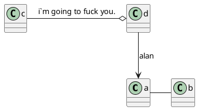

#### 加载配置文件

1. 读取 xml 文件，加载为 Resource
2. Resource 验证，解析 xml，转换为内部统一数据结构 BeanDefinition
3. 注册 BeanDefinition
4. 创建 Bean，三级缓存解决循环依赖。

```puml

@startuml

a - b
c -o d : i`m going to fuck you.
d --> a : alan

@enduml
```
