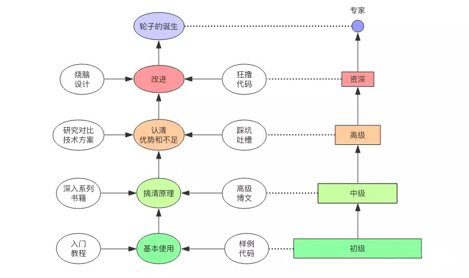

<!-- vim-markdown-toc GFM -->

- [我的码农学习笔记](#我的码农学习笔记)
  - [一些整理好的学习资料大纲，内容有部分重合](#一些整理好的学习资料大纲内容有部分重合)
  - [实用工具](#实用工具)
- [技术书籍阅读方法论](#技术书籍阅读方法论)
  - [重要原则](#重要原则)
  - [为什么要阅读源代码？](#为什么要阅读源代码)
  - [在阅读源代码之前，先完成下面工作：](#在阅读源代码之前先完成下面工作)
  - [阅读的节奏](#阅读的节奏)

<!-- vim-markdown-toc -->

### 我的码农学习笔记

> 计算机从业者的核心竞争力是计算机知识本身，语言只是一个子集，并且是很小的子集。  
  学好算法、OS、计算机网络、编译原理是最基本的。  
  优秀工程师所具备的能力无外乎4种，将现实问题转换为计算机问题的数学能力，对于语言本身的工具链熟悉程
  度（最为简单），计算机体系知识的掌握能力，以及对所有经验进行形而上的能力。

---

#### 一些整理好的学习资料大纲，内容有部分重合

- **Web前端，后端**  
  **[CS-Notes较通用的部分](https://github.com/CyC2018/CS-Notes)**

  **[Awesome Growth：技能图谱](http://awesome-growth.phodal.com/)**

  **[JavaGuide学习+面试指南](https://github.com/Snailclimb/JavaGuide)**

  **[Advanced-Java进阶](https://github.com/doocs/advanced-java)**

  **[Go开发者路线图](https://github.com/Quorafind/golang-developer-roadmap-cn)**

  **[JavaScript全栈培训材料](https://github.com/ruanyf/jstraining)**

  **[猫的前端回忆录](https://github.com/windiest/Front-end-tutorial)**

  **[前端面试指南](https://github.com/yangshun/front-end-interview-handbook)**

- **大数据**

- **大后端-机器学习**

- **Gui**

---

#### 实用工具

- **CheatSheet**  
  **[数据科学小抄](https://github.com/abhat222/Data-Science--Cheat-Sheet)**

---

### 技术书籍阅读方法论

#### 重要原则

1. 学任何技术，都有必要用销售的思维及6W3H 的框架去了解它被创造出来的背景，解决什么样的需求，改善了
   现有技术的哪些缺陷，它能够被广泛推广的原因，它的所有功能的边界范围等等。  

   **这其中分别需要考虑，(也并不是所有技术都要考虑这么多)**
   - what      它是什么？  
   - why       为什么需要它？  
   - when      它是什么时候的技术？  
   - who       谁发明的，这个人的背景是怎样的？  
   - how much  它怎样解决或改善现有技术存在的问题，解决到什么样的程度，功能的边界。  
   - whom      解决了哪些人的需求，是否刚需，面向什么样的市场，市场有多大。  
   - where     在什么地方诞生这个技术，行业产业链中这个技术应用的情况，能广泛应用的外在条件是怎样的？  

   - how many  同时期有多少竞争对手，为什么它会成功。  

2. 解决以上的问题，能够更深刻地理解技术的内涵及其**应用的业务场景**，适不适合当下的时代发展以及某个领域大概
   的**技术趋势**。

3. 完成以上前置准备后，自己动手造一个轮子，边造边看相关理论知识，事半功倍，而且会对其有更**本质**的了解。
   一张探索本质的图片。

   

---

#### 为什么要阅读源代码？

1. 自己不清楚应该怎么实现，看代码了解。

2. 为什么这么高效，看代码学习。

3. 为什么这么低效，看代码然后修改。

---

#### 在阅读源代码之前，先完成下面工作：

1. 阅读源码之前储备一些设计模式的知识，阅读起来将更省力。

2. 整体上了解代码是要解决什么问题。了解要阅读的框架或模块拥有的功能，在理论上能大致明白功能的流程。  
   初次阅读的目的是为了能掌握源码实现功能的流程，最好能自己画个类的时序图。  
   列举出自己对该框架的实现疑问点，带着问题去研究源码，从代码中找答案。  
   从疑问中自己试着去解答，去验证自己的猜想，这样能更有兴趣的读下去。

3. 再次重复阅读（带着目的）查看具体的实现细节。了解有哪些接口，有哪些类，为什么要这些接口和类。

4. 探究相关功能实现的底层原理，数据结构，设计模式等。

---

#### 阅读的节奏

1. 速读一遍(最好在1~2天内完成)。人的大脑记忆力有限，在一天内快速看完一本书会在大
   脑里留下深刻印象，对于之后复习以及总结都会有特别好的作用。  
   对于每一章的知识，先阅读标题，弄懂大概讲的是什么主题，再去快速看一遍，不懂也
   没有关系，但是一定要在不懂的地方做记号，什么记号无所谓，但是要让自己后面再看
   的时候有个提醒的作用，看看第二次看有没有懂了些。  

2. 精读一遍(在2周内看完)。有了前面速读的感觉，第二次看会有慢慢深刻了解思想和意识的作
   用。程序员打代码都是先实践，然后就渐渐懂了过程，慢慢懂了原理，所以第二遍读的时候稍
   微慢下来，2周内搞定。  
   注意：每看完一个章节后，总结一下这个章节讲了啥。很关键！  

3. 实践。在实践的时候要注意不用都去实践，最好看着书，敲下代码，把重点的内容敲一遍
   有个肌肉记忆就很不错了。到自己做过的项目中去把每个有涉及到原理的代码，研究
   一遍，就可以了。

