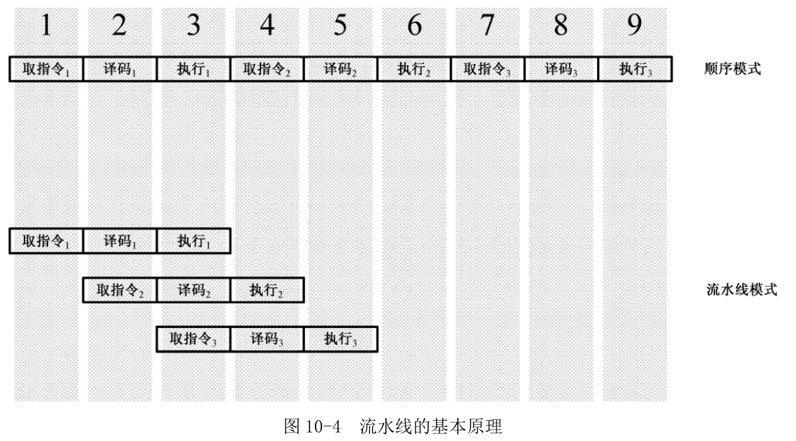

<!-- vim-markdown-toc GFM -->

- [并发相关概念](#并发相关概念)
  - [1. 通用概念](#1-通用概念)
  - [2. 并发](#2-并发)
  - [3. 不同并发模式的优缺点](#3-不同并发模式的优缺点)
  - [4. 事件驱动、异步回调和协程](#4-事件驱动异步回调和协程)
  - [5. 线程的安全](#5-线程的安全)
  - [6. 编程模型选择](#6-编程模型选择)
  - [7. 语言相关的特点](#7-语言相关的特点)

<!-- vim-markdown-toc -->

## 并发相关概念

---

### 1. 通用概念
- #### 进程的定义：  
  进程是资源分配的最小单位。一个运行的程序实例就是一个进程。程序本身只是指令、数据及其组织形式的描述。  

- #### 线程的定义：  
  线程是CPU能够进行调度的最小单位。进程由至少一个线程组成。
  - 一个线程指的是进程中单一顺序的控制流，一个进程可以并发多个线程，每个线程执行不同的任务。  
  - 单进程多线程也可以利用多核CPU。  

- #### 线程和进程关系：  
  - 资源分配
  - 调度：同一进程中、不同进程中线程的切换。
  - 系统开销：创建和撤销时，切换时。
  - 通信区别：进程共享数据，IPC。

- #### 并发和并行：  
  - 并发是一种能力，关注点在任务的切分，基于操作系统分时复用的虚拟技术。  
  - 并行是实施状态，关注点在同时，需要 **硬件层面**(流水线-指令级并行) 的支持，根据接收的指令和数据量不同有多种架构。  
  - 并发不要求一定并行，利用并发可以制造出并行的假象。如果程序可以并行，那并发就是自然而然的。　　

  > 流水线是采用分治思想把一条指令的执行过程分解成若干个细小的步骤，并由不同的单元完成，各个单元独立，并行执行。  
    要优化程序执行时间，就可以借鉴这种细化执行粒度，让每一级任务减少的思想。

  

### 2. 并发
> 随着硬件的发展及生产环境对软件需求的不断提高，必须要实现程序并发的技术。

- #### 为什么要并发：  
  - 提高程序的性能，充分利用多核。  
  - 提高程序的容错能力，并发将程序切分，更容易理解和测试。  

- #### 并发多任务的实现方式：  
  - 利用操作系统提供的进程和线程，实现多进程模式或者多线程模式。  
  - 利用编程语言内置的用户级线程，实现单线程+协程模式。  

### 3. 不同并发模式的优缺点
- #### 多进程模式：  
  - **优点**：稳定性高，一个子进程崩溃不会影响主进程和其他子进程。当然主进程挂了所有进程就全挂了，
    但是Master进程只负责分配任务，挂掉的概率低。  

  - **缺点**：创建进程的代价大，在Unix/Linux系统下，用fork调用还行，在Windows下创建进程开销巨大。  
    另外，操作系统能同时运行的进程数也是有限的，在内存和CPU的限制下，如果有几千个进程同时运行，
    操作系统连调度都会成问题。  

- #### 多线程模式：  
  - **优点**：比进程占用资源少，切换简单，CPU利用率高。

  - **缺点**：任何一个线程挂掉都可能直接造成整个进程崩溃，因为所有线程共享进程资源。  
    多线程共享数据最大的危险在于多个线程同时修改一个变量，把内容改乱。因此必须要有进程锁(互斥锁)。
    一个进程只有一个锁，同一时刻只能有一个线程持有该锁，获得锁的线程用完后一定要释放锁给其他线程用。  

  - **锁的好处**是确保某段关键代码只能由一个线程执行。  

  - **锁的坏处**是阻止了多线程并发执行，因为包含锁的某段代码实际只能以单线程模式执行，效率下降。  
    其次可以存在多个锁，不同线程持有不同锁，并试图获取对方的锁时，可能会造成死锁，导致多个线程被
    挂起。

- #### 单线程+协程模式：  
  大部分编程语言中协程只适用于**IO密集型**的任务，**Go** 中协程可以应用于**CPU密集型**任务，有效利用多核。

### 4. 事件驱动、异步回调和协程
- #### 为什么会有事件驱动(事件轮询)：  
  服务器领域为了解决单台服务器有限资源处理10K量级的并发连接问题，产生事件驱动编程，如 linux 的[IO多路复用](https://github.com/CyC2018/CS-Notes/blob/master/notes/Socket.md#%E4%BA%8Cio-%E5%A4%8D%E7%94%A8)
  三种机制中的一种epoll技术。

- #### 事件驱动和异步回调：  
  - 通过事件循环机制，不断从**事件(任务)队列**查询是否有事件(任务)发生，只要读取到事件，就会调用和此事件关
  联的回调函数，整个过程是**非阻塞**的，可以实现异步的并发编程。  

  - **优点**： 基于单线程实现，所以不需要考虑并发设计和锁，不需要考虑内部调度，并且非阻塞。

- #### 为什么会有协程：  
  - 在复杂业务中，异步回调函数会使代码充斥多种嵌套，不符合人类思维直觉，代码维护困难。因此出现了Promise 和
    Future 两种方案处理回调函数。

  - **Promise** 站在任务处理者的角度，将异步任务成功或失败的状态封装在 Promise 对象中，通过 then、catch 分
    别调用成功或失败的处理函数逻辑。  
    **如**Javascript 里面的Promise，Java里的CompletableFuture，Python里面的asyncio.Future

  - **Future** 站在任务调用者的角度，检测任务是否完成，如果完成则直接获取结果，如果未完成则阻塞直到获取结
    果，或者编写回调函数避免阻塞，根据相应的完成状态执行回调函数。  
    **如**Java里的util.concurrent.Future，Python里面的concurrent.Future。

  - 虽然有了 Promise 和 Future，但是代码依然有冗余，而且业务逻辑的语义在用 Promise 时会表义不清，为了改善
    异步编程体验，让码农可以用写同步代码的方式编写可异步执行的代码，**协程**这个古老的概念又被提出。

- #### 什么是协程：  
  - 协程在**编程语言的层面**实现对**线程**的调度，避免了内核级别的上下文切换造成的性能损失，进而突破了线
    程在IO上的性能瓶颈，同时内存占用更小，是一种用户态的轻量级线程。

  - 协程抽象的本质就是**控制流的出让和恢复**。

- #### 协程和线程的关系：
  - 线程是内核分配时间片进行抢占式调度的，从而确保每个线程都有执行的机会。  

  - 协程运行在同一个线程中，不需要系统来执行抢占式调度，而是在语言层面实现线程的调度。  

- #### 协程的系统开销
  - 协程有有有栈和无栈区别，调度器有的有，有的没有，不同**编程语言**协程实现方式及特性有所不同。  
    具体见[7. 语言相关的特点](#7-语言相关的特点)  
  
  - 协程内存开销比异步回调大，一个协程一个栈，而异步毁掉一个事件循环一共就一个栈。

### 5. 线程的安全

- #### 线程执行的特点：
  - 现代CPU具有乱序执行、编译器具有对代码进行[指令重排](https://blog.csdn.net/lindanpeng/article/details/72459493)
    的优化特性。线程调度完全由系统内核控制，多个线程的执行顺序无法预测，同一段代码多次运行会产生不同的结果。  

  - 多线程编程存在资源同步问题，即多个线程可以同时操作某个数据，同时读取同一块内存没有问题，同时写会出现**数
    据同步**问题。

- #### 线程安全的定义：
  > 如果一个方法、数据结构或库在多线程环境中不会出现任何问题，则可以称为**线程安全**。  

  - **面向对象中线程安全(thread-safe)的类**：  
    成员变量不可变的类。Java中 final 修饰的，c++中 const 。  
    没有成员的类，往往是工具类。Java中Math。  
    正确使用语言功能实现线程安全的类。Java中正确使用 synchronized 的类。

  - **非线程安全的类**：  
    不能在多线程中共享实例并**修改**的类。C++中vector，Java中ArrayList，Python中list。  
    可以在多线程中以只读方式共享。

- #### 竞态条件和临界区：
  > 多线程编程的重点就是写出线程安全的代码，因此就需要了解安全的边界在哪。

  - **竞态条件**：  
    当某个计算的正确与否**需要**多个线程交替执行的**确定性**顺序时，就会产生竞态条件。因为多线程具有乱序执行
    的特性。  

    > 比如将“读取－修改－写入”或“先检查后执行”中的各个步骤**拆分到不同线程**执行，这些步骤都是需要有先后顺序
      的，这个时候就会产生竞态条件。  

  - **临界区**：产生竞态条件的区域叫做临界区。

  - **数据竞争**：多个线程对同一变量进行操作，且至少有一个线程对其进行写操作，就会产生数据竞争，导致各个线程
    获取的数据不一致。

  - 并非所有的竞态条件都是数据竞争，也并非所有的数据竞争都是竞态条件。

  - 要消除**竞态条件**，需要保证线程按指定顺序来执行。使用编程语言提供的同步机制。  
    要避免**数据竞争**，需要保证相关数据结构的原子性。使用编程语言提供的互斥和原子类型。

- #### 解决数据竞争问题：

  - **线程锁(互斥锁)**：  

    - 当多线程程序需要在不同线程间进行数据通信时(修改非只读共享变量)，就会涉及到数据的同步。  
      **为了解决数据竞争问题**需要给当前操作数据的线程上锁。锁可以保护临界区，同时达到同步和互斥的效果。

    - 根据不同的并发场景，有不同类型的锁，如互斥锁，读写锁，自旋锁。  
      **互斥锁**是指同一时刻只允许单个线程对临界资源进行访问。  
      > 当某个线程修改非线程安全的数据前(即执行对应的代码块之前)，先让这个线程获得一个锁，保
        证在修改数据过程中其他线程无法修改这个数据，在修改完后(即对应代码块执行完后)，释放这个线程获得的
        锁，再让其他线程可以对这个数据进行操作。

      **读写锁**可以同时支持多个线程读或单个线程写。

      **自旋锁**与互斥类似，但当获取锁失败时，不会让线程休眠，而是不断轮询直到获取锁成功。
   
    - **注意**：多个线程同时读取数据是允许的，但只要有一个线程在写，其他线程就必须等待。

    - **缺点**：线程锁会降低代码的执行效率，因为在线程上锁的期间，程序不是并发进行的。

    - **锁**是一种粗粒度的代码块控制手段。

  - **死锁**：
    > 死锁发生后，没有任何机制能解除死锁，只能强制结束当前进程。

    - **形成条件**：多个线程各自持有不同的锁，并试图获取对方已持有的锁时，双方无限等待下去导致死锁。  
      |  线程1  |  线程2  |
      |---------|---------|
      | 持有A锁 | 持有B锁 |
      | 等待B锁 | 等待A锁 |

    - **如何避免**： 多线程获取锁的顺序要一致。

  - **原子类型**：
    
    - 修改临界数据结构的内部实现，确保对它们做任何更新，在外界看来都是原子性的，保证事务不可中断或者什
      么都不做，避免多线程中数据的不一致。

    - 原子类型是一种比锁更细粒度的数据结构内部控制手段。
    

- #### 解决竞态条件(线程同步、协调)

  > 当需要保证多个线程交替执行的**确定性**顺序时，就需要消除竞态条件的影响，其关键在于判断出正确的临界区。

  - **条件变量**
    用来自动阻塞一个线程，直到出现指定的条件，通常和互斥锁配合使用。

  - **信号量**
    可以在线程间传递信号，为资源访问进行计数。所有通过它的线程都会将计数减1，如果信号量为0，其他线程只能
    等待。

  - **屏障**
    可以让一系列线程在某个指定的点进行同步。通过让参与指定屏障区域的线程等待，直到所有线程都到达指定的点。

### 6. 编程模型选择  

- #### 线程切换：
  线程切换会消耗系统资源，需要先进行现场保存，然后准备新的执行环境(恢复上次的寄存器状态，切换内存页等)。

- #### 考虑执行任务的特点：  
  - 计算密集型：进行大量计算，主要消耗CPU资源，计算元周率，视频解码等。  
    任务同时进行的数量应等于CPU的核心数。
    代码运行效率至关重要，最好用C/C++。

  - IO密集型：磁盘IO，网络IO等。CPU消耗资源少，大部分时间在等待IO完成。  
    任务越多，CPU效率越高。但也有个限度。
    开发效率高的语言最好，如Python。

- #### IO操作类型：  
  - **同步IO多线程或多进程实现并发**：  
    因为CPU和IO的速度差异，一个线程中如果遇到IO操作，就要等待IO操作完成，才能进行下一步操作，这种叫同步IO。  
    因为一个IO操作就阻塞了当前线程，导致其他代码无法执行，所以必须使用多线程或多进程来并发执行代码，为多个
    用户服务。每个用户都会分配一个线程，如果遇到IO线程被挂起，其他用户的线程不受影响。

  - **异步IO实现并发**：  
    多线程和多进程模型虽然解决了并发问题，但系统切换线程的开销很大，不可能无上限增加线程。  
    利用操作系统提供的事件驱动模型可以进行异步IO编程，它在单核CPU上采用单进程模型就可以高效执行多任务。  
    当代码需要执行一个耗时的IO操作时，在同步IO模型下，主线程只能挂起阻塞。
    而在异步IO模型下，主线程并没有休息，它在消息循环中继续处理其他消息。这样，在一个线程内就可以同时处理多
    个IO请求，并且没有线程切换开销。对于大多数IO密集型的应用程序，使用异步IO将大大提升系统的多任务处理能力。  

- #### 并发模型：
  - 传统的基于共享内存，利用锁的同步机制
    - C++，Java，Python，Rust，Go

  - 基于通信共享内存(Actor, CSP)
    - Actor：Scala, Erlang
      Actor以 actor 为中心，不关心通信的中间管道，关心消费方的应答，能接收多种类型数据，因此需借助模式匹配
      根据不同类型进行消息或任务分发，适合分布式应用。

    - CSP：Go(mpmc)，Rust(mpsc)
      CSP以 channel 为中心，一个channel只能接收一种类型数据，不关心对方消息是否有应答，所以需多路监听，
      适合主从模式并发。

  - 只能用于IO密集型场景的协程
    - JavaScript，Python，Lua

  - 全能协程 Go

### 7. 语言相关的特点

- #### Python

  - Python 由于**全局锁GIL**的存在，不能有效利用多核，因此对于计算密集型任务，必须使用多进程方式加速。

  - Python 的**单线程**异步编程模型称为协程，可以基于事件驱动模型编写并发程序。  
    Python的协程源于yield指令。yield 类似惰性求值的方式可以看成一种流程控制的工具，实现协作式多任务。
    yield有两个功能:
      - yield item 用于产出一个值，反馈给next()的调用方。

      - 让出控制权，暂停执行生成器，让调用方继续工作，直到需要使用另一个值时再调用next()。

    在Python3.5 引入async/await，使协程在语言层面得到支持和优化，简化之前的yield写法。  
    让出执行的关键字就是 await。

  - Python **协程的特点**：  
    - 协程运行在同一个线程中，由语言运行时中的 **EventLoop 事件循环**进行调度，依赖IO 多路复用技术。  

    - async 协程的调度是非抢占式的，一个协程必须主动让出执行机会，其他协程才有机会执行。  
      也就是说如果一个协程阻塞，持续不让出CPU，那整个线程都会阻塞，没有任何并发。

    - 一旦使用async 函数，整个程序都必须是async 的，因为一旦某个同步程序阻塞，那整个线程都会阻塞。

  - Web中的应用：  
    - 作为服务端，event loop的核心的是IO多路复用技术，所有来自客户端的请求都由IO多路复用函数来处理。  

    - 作为客户端，event loop的核心在于利用Future对象延迟执行，并使用send函数激发协程,挂起,等待服务端处理完
      成返回后再调用CallBack函数继续下面的流程

- #### Go：

  - Go 有两种并发形式：
    - 传统的基于共享内存的多线程并发。同 Java 和 C++ 在多线程共享数据时，通过锁访问。

    - 基于CSP(通信序列处理)，通过channel(管道)通信在不同协程间传递消息。
      (erlang是基于进程的消息通信)

  - Go **协程的特点**：
    - 通过系统线程多路派遣协程函数执行，用 Go 关键字执行的函数可运行为一个单位协程。
    
    - 不需要显式使用await 让出控制权，但也不会严格按照时间片调度goroutine，而是在可能阻塞的地方插入调度。
      可以看成是半抢占式的。

    - 当一个 goroutine 使其所在线程阻塞时，调度器会自动把其他协程安排到空闲线程中执行，没有就创建新线程。
      从而实现无阻塞并行化运行，可以利用多核，并且开销非常小。
  
    - 不使用共享内存/数据，而是使用通信的消息机制来共享内存/锁。

  - 协程的状态：
    - Pending
    - Running
    - Done
    - Cancelled

- #### Java：

  - 线程的状态：
    - New(新创建)： 这时线程**还没有运行**代码，有一些基础工作要做。

    - Runnable(可运行)：  
      一旦调用start()方法，线程才处于runnable状态。注意此时为**可运行**而不是**正在运行**。  
      当线程数目多于CPU数目时，抢占式调度系统采用时间片机制来保证每个线程都能被执行。

    - Blocked(被阻塞)： 

    - Waiting(等待)：

    - Timed waiting(计时等待)：

    - Terminated(被终止)：

  - **volatile：**  解决了多个线程间数据**读取**可见性的问题。  
    被标记为volatile的字段会禁止编译器指令重排并且在读取字段时强制CPU刷新本地内存缓冲使之与主内存状态同步。
    注：该关键字在C++中含义与Java中不一样，C++中没有线程同步的功能，即使有也只是部分编译器的扩展，
        无可移植性。  
        volatile 标记的变量不能提供原子性，如取反，写入。

  - **synchronized：**  解决了多线程之间数据竞争的问题，没有解决多线程协调(执行顺序)的问题。  

  - **wait 和 notify：**  
    这两个方法解决线程间协调(执行顺序)的问题。当条件不满足时，线程进入等待状态。

    - wait方法**只能**在synchronized语句块中调用。

    - 假设this指向一个用来封装线程间共享数据结构的类实例。调用wait方法后将**释放this的锁**，并使调
      用synchronized-wait语句块的线程进入**等待状态**。

    - 当某个条件满足，其他线程调用this.notify方法**唤醒等待的线程**，等待的线程将**重新获得this的锁**。  

      

  - **java.util.concurrent：** 包提供了比synchronized-wait语句快更高级别的API来实现多线程同步和协调。

    - **ReentrantLock 和 Condition：** 配合可以替代synchronized与wait-notify的功能，Condition对象必须从
      ReentrantLock对象获取。

    - **ReadWriteLock：**  只允许一个线程写入，允许多个线程同时读取。  
      适合读多写少的场景。同一个实例，有大量线程读取，仅有少数线程修改。  
      例如一个论坛帖子，回复不频繁，可看作写入。浏览频繁，可看作读取。

    - **Concurrent 集合：**  线程安全的集合类。
      

