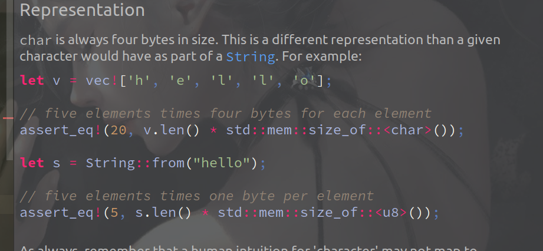

<!-- vim-markdown-toc GFM -->

- [计算机编码](#计算机编码)
    - [ASCII:](#ascii)
    - [Unicode:](#unicode)
    - [UTF-8:](#utf-8)
    - [各语言编码特点：](#各语言编码特点)

<!-- vim-markdown-toc -->

### 计算机编码

---

> 计算机只能处理数字，要处理文本，必须先把文本转换为数字才能处理。  
> 1 byte = 8 bit，一个字节能表示2^8=256个字符，能表示最大整数255（除去0）。  
  要表示中文，显然一个字节，8位是不够多的。至少需要两个字节。  

**注**：  
- 通常书上都用一个框表示一个字节，即8个二进制位，两个16进制数字。  
- A：| 二进制 0100 0001 | 十进制 65 | 十六进制 0x41 (四个二进制位表示一个十六进制数)  

---

##### ASCII:  
  - 最早的字符编码是ASCII码(America Standard Code For Information Interchange)。  

  - **特点**：  一个字符占用一个字节(byte)，8位，最高位总是0。  
    由于一个bit可以有0,1两个数，所以用ASCII码编码的一个字符类型最多可表示1 X 2^7 = 128 个
    不同字符。  

---

##### Unicode:  
  - **产生背景**： 为了解决各个国家编码不一致的情况。  

  - **特点**： 一个字符占用2-4个字节(byte)，16-32位，最高位总是0。一个字符最多可表示  
    1 X 2^15 = 32768 个不同字符。  

  - **作用**： 能使计算机实现跨语言，跨平台的文本处理。  

---

##### UTF-8:  
- **产生背景**：  
  - 英文的Unicode编码与ASCII不一致。

  - 由于Unicode的编码特性，包含大量英文的文本会浪费存储空间。  

- **特点**：  
  - 变长编码，英文UTF-8与ASCII一致，其他需2~6个字节不等。

  - 容错能力强，兼容性好。

- **编码方式**：
  - 一个字节的首位永远是0，   0xxxxxxx。

  - 两个字节的首位永远是110， 110xxxxx 10xxxxxx

  - 三个字节的首位永远是1110，1110xxxx 10xxxxxx 10xxxxxx

  - 依此类推。。

- **作用**：  
  - 能使计算机实现跨语言，跨平台的文本处理，并比Unicode更节省空间。  

---

##### 各语言编码特点：
- C：     默认ASCII编码，所以一个char类型在32位系统上占8bit，1个byte。  
- C++：   兼容C，正常情况一个char类型占8位，也有宽wchar_t 和支持Unicode的char16和char32。  
- Python：诞生比Unicode标准发布还早，所以最早的python只支持ASCII编码。  
- Java：  Java平台无关，默认Unicode编码，一个char类型永远占16bit，2个byte。  
- Rust：  Rust平台无关，默认UTF-8编码，但一个char类型总是占32bit，4个byte。  
          要注意的是Rust里单个字符在String中占用的byte和单个字符存在占用的byte是不一样的。
          如下图：

