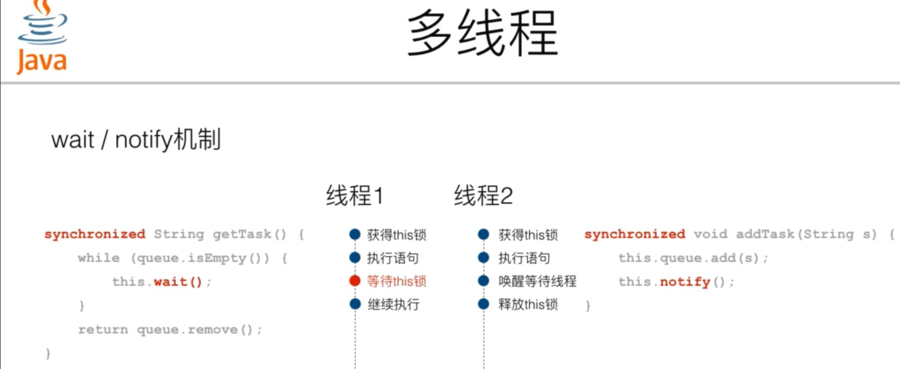

<!-- vim-markdown-toc GFM -->

- [概念](#概念)
- [编程模型选择](#编程模型选择)
  - [线程安全](#线程安全)
- [语言相关的特点](#语言相关的特点)

<!-- vim-markdown-toc -->

#### 概念

> 一个任务就是一个进程。  
  线程是CPU最小的执行单元，而进程由至少一个线程组成。

1. 多任务的实现有3种方式：  
    - 多进程模式  
    - 多线程模式  
    - 多进程+多线程模式  

2. 进程与线程区别：  
    - 多进程模式：  
      - 优点就是稳定性高，因为一个子进程崩溃了，不会影响主进程和其他子进程。  
       （当然主进程挂了所有进程就全挂了，但是Master进程只负责分配任务，挂掉的概率低）。  
      - 缺点是创建进程的代价大，在Unix/Linux系统下，用fork调用还行，在Windows下创建进程开销巨大。  
        另外，操作系统能同时运行的进程数也是有限的，在内存和CPU的限制下，如果有几千个进程同时运行，
        操作系统连调度都会成问题。  

   - 多线程模式：  
     - 通常比多进程快一点，但是也快不到哪去。  
        缺点就是任何一个线程挂掉都可能直接造成整个进程崩溃，因为所有线程共享进程资源，参数，内存。  
        多线程共享数据最大的危险在于多个线程同时修改一个变量，把内容改乱。因此必须要有进程锁（互斥锁）。  
        一个进程只有一个锁，同一时刻只能有一个线程持有该锁，获得锁的线程用完后一定要释放锁给其他线程用。  

     - 锁的好处就是确保某段关键代码只能由一个线程执行。  
     - 坏处是阻止了多线程并发执行，因为包含锁的某段代码实际只能以单线程模式执行，效率下降。  
        其次可以存在多个锁，不同线程持有不同锁，并试图获取对方的锁时，可能会造成死锁，导致多个线程被
        挂起。

#### 编程模型选择  

1. 线程切换：   
   线程切换会消耗系统资源，需要先进行现场保存，然后准备新的执行环境(恢复上次的寄存器状态，切换内存页等)。

2. 考虑执行任务的特点：  
  - 计算密集型：进行大量计算，主要消耗CPU资源，计算元周率，视频解码等。  
    任务同时进行的数量应等于CPU的核心数。
    代码运行效率至关重要，最好用c。

  - IO密集型：磁盘IO，网络IO等。CPU消耗资源少，大部分时间在等待IO完成。  
    任务越多，CPU效率越高。但也有个限度。
    开发效率高的语言最好，如python。

3. IO操作类型：  
   - 同步IO多线程或多进程实现并发：  
     因为CPU和IO的速度差异，一个线程中如果遇到IO操作，就要等待IO操作完成，才能进行下一步操作，这种叫同步IO。  
     因为一个IO操作就阻塞了当前线程，导致其他代码无法执行，所以必须使用多线程或多进程来并发执行代码，为多个
     用户服务。每个用户都会分配一个线程，如果遇到IO线程被挂起，其他用户的线程不受影响。

   - 异步IO实现并发：  
     多线程和多进程模型虽然解决了并发问题，但系统切换线程的开销很大，不可能无上限增加线程。
     利用操作系统提供的事件驱动模型可以进行异步IO编程，它在单核CPU上采用单进程模型就可以高效执行多任务。

     当代码需要执行一个耗时的IO操作时，它只发出IO指令，并不等待IO操作返回的结果，然后就去执行其他代码了。
     一段时间后，当IO返回结果时，再通知CPU进行处理。

4. python的**单线程**异步编程模型称为协程，可以基于事件驱动编写高效的多任务程序。  

> 同步IO模型的代码是无法实现异步IO模型的。  

> 异步IO模型需要实现一个消息循环，主线程不断处理 **读取消息，处理消息** 的过程。  
  当遇到IO操作时，代码只负责发出IO请求，不等待IO结果，然后直接结束本轮消息处理，进入下一轮消息处理过程。  
  当IO操作完成后，将收到一条 **IO完成** 的消息，处理该消息时就可以直接获取IO操作结果。  

> 在 **发出IO请求** 到收到 **IO完成** 的这段时间里，同步IO模型下，主线程只能挂起。  
  但异步IO模型下，主线程并没有休息，而是在消息循环中继续处理其他消息。这样，在异步IO模型下，一个线程就
  可以同时处理多个IO请求，并且没有切换线程的操作。对于大多数IO密集型的应用程序，使用异步IO将大大提升系统
  的多任务处理能力。  

---

##### 线程安全

1. 线程之间能够安全地共享数据的数据结构被称为线程安全的。面向对象中线程安全(thread-safe)的类有下面的三种：
    - 成员变量不可变的类。java中final修饰的，c++中const。
    - 没有成员的类，往往是工具类。java中Math。
    - 正确使用语言功能实现线程安全的类。java中正确使用synchronized的类。

2. 同一个进程中不同线程之间的数据都是共享的，即多个线程可以同时操作某个数据。  
   如果某个线程对非线程安全的数据修改时被中断，而这时正好有其他线程也对这个数据进行修改，就会破坏数据的原
   子性，也就是把共享数据改乱了，两个线程中共享数据不一致。  

3. 线程锁：
   当多线程程序需要在不同线程间进行数据通信(修改非只读共享变量)，就会涉及到数据的同步。要解决上面的问题就
   需要给线程加锁。  
   线程锁指的是当某进程中一个线程修改非线程安全的数据前(即执行对应的代码块之前)，先让这个线程获得一个锁，
   保证在修改数据过程中其他线程无法修改这个数据，在修改完后(即对应代码块执行完后)，释放这个线程获得的锁，
   让其他线程可以对这个数据进行操作。
    
   多个线程同时读取数据是允许的，但只要有一个线程在写，其他线程就必须等待。
   |      | 读      | 写      |
   | ---- | ------- | ------- |
   | 读   | 允许    | 不允许  |
   | 写   | 不允许  | 不允许  |

   缺点： 线程锁会降低代码的执行效率，因为在线程上锁的期间，程序不是并发进行的。

4. 非线程安全的类：
    - 不能在多线程中共享实例并**修改**的类。c++中vector，java中ArrayList，python中list。
    - 可以在多线程中以只读方式共享。

5. 死锁：
    - 形成的条件：多线程各自持有不同的锁，并互相试图获取对方已持有的锁时，双方无限等待下去导致死锁。  
       |  线程1  |  线程2  |
       |---------|---------|
       | 持有A锁 | 持有B锁 |
       | 等待B锁 | 等待A锁 |

    - 如何避免死锁： 多线程获取锁的顺序要一致。

    > 死锁发生后，没有任何机制能解除死锁，只能强制结束当前进程。

#### 语言相关的特点

1. Java：
    1. synchronized解决了多线程之间竞争的问题，没有解决多线程协调的问题。  
       多线程的协调运行：当条件不满足时，线程进入等待状态。

    2. wait 和 notify 方法来解决线程间协调的问题。
        - wait方法只能在synchronized语句块中调用。
        - 假设this指向一个用来封装线程间共享的数据结构的类。
        - 调用wait方法后将释放this的锁，并使调用synchronized-wait语句块的线程进入等待状态。
        - 当某个条件满足，其他线程调用this.notify方法唤醒等待的线程，等待的线程将重新获得this的锁。  
        > 
         

    3. java.util.concurrent包提供了高级更方便的API来实现多线程
        - ReentrantLock和Condition配合可以替代synchronized与wait-notify的功能，Condition对象必须从
          ReentrantLock对象获取。
        - ReadWriteLock： 只允许一个线程写入，允许多个线程同时读取。  
          适合读多写少的场景。同一个实例，有大量线程读取，仅有少数线程修改。  
          例如一个论坛帖子，回复不频繁，可看作写入。浏览频繁，可看作读取。
        - Concurrent集合：线程安全的集合类。
        - ---
         
        - java.util.atomic 提供的原子操作可以简化多线程编程，实现了无锁的线程安全，
          可用来实现计数器，累加器。

